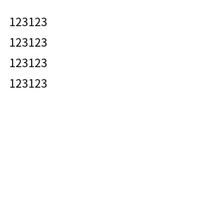
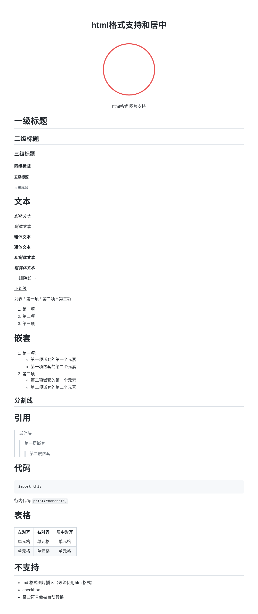
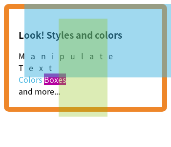
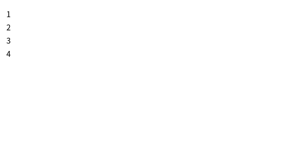

# nonebot-plugin-htmlrender

- 通过浏览器渲染图片
- 可通过查看`example`参考使用实例
- 如果有安装浏览器等问题，先查看文档最底下的`常见问题`再去看 issue 有没有已经存在的

## ✨ 功能

- 通过 html 和浏览器生成图片
- 支持`纯文本` `markdown` 和 `jinja2` 模板输入
- 通过 CSS 来控制样式

## 使用

参考[example/plugins/render/**init**.py](example/plugins/render/__init__.py)

```py
from nonebot import require

require("nonebot_plugin_htmlrender")
# 注意顺序，先require再 from ... import ...
# 注意顺序，先require再 from ... import ...
# 注意顺序，先require再 from ... import ...
from nonebot_plugin_htmlrender import (
    text_to_pic,
    md_to_pic,
    template_to_pic,
    get_new_page,
)
# 注意顺序，先require再 from ... import ...
# 注意顺序，先require再 from ... import ...
# 注意顺序，先require再 from ... import ...
```

## 配置

### .env 配置项说明

```ini
# Playwright 浏览器引擎类型
# 可不填，默认为 "chromium"
htmlrender_browser = "chromium"

# Playwright 浏览器下载地址
# 可选，用于自定义浏览器下载源
htmlrender_download_host = ""

# Playwright 浏览器下载代理
# 可选，用于配置下载浏览器时的代理
htmlrender_download_proxy = ""

# Playwright 浏览器代理地址
# 可选，用于配置浏览器访问时的代理
# 示例: htmlrender_proxy_host = "http://127.0.0.1:7890"

# Playwright 浏览器代理绕过地址
# 可选，指定不使用代理的地址
htmlrender_proxy_host_bypass = ""

# Playwright 浏览器通道
# 可选，支持以下值:
# - Chrome: "chrome", "chrome-beta", "chrome-dev", "chrome-canary"
# - Edge: "msedge", "msedge-beta", "msedge-dev", "msedge-canary"
# 配置后可直接使用系统浏览器，无需下载 Chromium
htmlrender_browser_channel = ""

# Playwright 浏览器可执行文件路径
# 可选，用于指定浏览器程序位置
htmlrender_browser_executable_path = ""

# CDP 远程调试地址
# 可选，用于连接已运行的浏览器实例
# 使用时需要在启动浏览器时添加参数 --remote-debugging-port=端口号
htmlrender_connect_over_cdp = "http://127.0.0.1:9222"

# Playwright ws 连接地址
# 可选，用于连接 playwright 的 docker 容器
# https://playwright.dev/docs/docker
# 配套的 docker-compose.yaml 中，已经填好了
htmlrender_connect="ws://playwright:3000"
```

### 远程浏览器使用说明

当使用远程浏览器（通过 `htmlrender_connect` 或 `htmlrender_connect_over_cdp` 配置）时，本地文件系统的 `file://` 协议将无法访问。此时需要：

#### 1. 使用 `html_to_pic` 函数

可以直接传入不同的 URL 协议：

```python
from nonebot_plugin_htmlrender import html_to_pic

# 使用 about:blank（推荐用于纯 HTML 内容）
pic = await html_to_pic(
    html="<html><body><h1>Hello</h1></body></html>",
    template_path="about:blank"
)

# 使用 data URL
pic = await html_to_pic(
    html="<html><body><h1>Hello</h1></body></html>",
    template_path="data:text/html,<html></html>"
)

# 使用 HTTP URL（需要有可访问的 Web 服务器提供资源）
pic = await html_to_pic(
    html="<html><body><h1>Hello</h1></body></html>",
    template_path="http://your-server.com/base/"
)
```

#### 2. 使用 `template_to_pic` 函数

需要通过 `pages` 参数的 `base_url` 字段指定浏览器使用的基础 URL：

```python
from nonebot_plugin_htmlrender import template_to_pic
from pathlib import Path

template_path = str(Path(__file__).parent / "templates")

# 对于远程浏览器，使用 about:blank 或 HTTP URL
pic = await template_to_pic(
    template_path=template_path,  # 本地模板路径（用于 jinja2 加载）
    template_name="my_template.html",
    templates={"data": "value"},
    pages={
        "viewport": {"width": 600, "height": 300},
        "base_url": "about:blank",  # 浏览器使用的基础 URL
    },
)

# 如果模板中有相对路径的资源（如图片、CSS），需要使用 HTTP URL
pic = await template_to_pic(
    template_path=template_path,
    template_name="my_template.html",
    templates={"data": "value"},
    pages={
        "viewport": {"width": 600, "height": 300},
        "base_url": "http://your-server.com/static/",
    },
)
```

**注意**：
- `template_path` 参数始终是本地文件系统路径，用于 jinja2 模板引擎加载模板文件
- `base_url` 参数是浏览器使用的基础 URL，用于解析 HTML 中的相对路径资源

## 部署

### （建议）使用 docker compose 进行部署

> 前提条件：你的项目使用 uv 管理 或 `pyproject.toml` 的 `dependencies` 中已经包含你的依赖
>
> 此方法会将 nonebot2 和 playwright 分开两个容器

1. 将 `docker-compose.yaml` & `entrypoint.sh` 复制到你自己的项目根目录下
2. 根据你的需要调整 `docker-compose.yaml` & `entrypoint.sh`
3. 拉取镜像 `docker compose pull`
4. 启动容器 `docker compose up -d`

> - 查看日志 `docker compose logs -f`
> - 停止/重启容器 `docker compose`

### docker 单容器部署

> 前提条件：你的项目使用 uv 管理 或 `pyproject.toml` 的 `dependencies` 中已经包含你的依赖
>
> 此方法会将 nonebot2 和 playwright 运行在同一个容器中
>
> 而且你还有需要清楚你要干什么

1. 将 `docker-compose.yaml` & `entrypoint.sh` 复制到你自己的项目根目录下
2. 根据你的情况，调整指令

```bash
docker run -d \
--name nonebot2 \
-v $(pwd):/app \
-p 9012:9012 \
-e "PLAYWRIGHT_BROWSERS_PATH=/app/pw-browsers" \
ghcr.io/kexue-z/nonebot-plugin-htmlrender/nonebot2-playwrght-uv sh -c "./entrypoint.sh"
```

## 说明
### markdown 转 图片

- 使用 `GitHub-light` 样式
- 支持绝大部分 md 语法
- 代码高亮
- latex 数学公式 （感谢@[MeetWq](https://github.com/MeetWq)）
    - 使用 `$$...$$` 来输入独立公式
    - 使用 `$...$` 来输入行内公式
- 图片需要使用外部连接并使用`html`格式 否则文末会超出截图范围
- 图片可使用 md 语法 路径可为 `绝对路径`(建议), 或 `相对于template_path` 的路径

### 模板 转 图片

- 使用 jinja2 模板引擎
- 页面参数可自定义

## 🌰 栗子

[example.md](docs/example.md)

### 文本转图片（同时文本里面可以包括 html 图片）



### markdown 转图片（同时文本里面可以包括 html 图片）



### 纯 html 转图片



### jinja2 模板转图片



## 特别感谢

- [MeetWq](https://github.com/MeetWq) 提供数学公式支持代码和代码高亮

## 常见疑难杂症

### `playwright._impl._api_types.Error:` 初次运行时报错

- 一般为缺少必要的运行环境，如中文字体等

### Ubuntu 使用 `apt`

- 参考[Dao-bot Dockerfile](https://github.com/kexue-z/Dao-bot/blob/a7b35d6877b24b2bbd72039195bd1b3afebb5cf6/Dockerfile#L12-L15)

```sh
apt update && apt install -y locales locales-all fonts-noto libnss3-dev libxss1 libasound2 libxrandr2 libatk1.0-0 libgtk-3-0 libgbm-dev libxshmfence1
```

- 然后设置 ENV local

```sh
LANG zh_CN.UTF-8
LANGUAGE zh_CN.UTF-8
LC_ALL zh_CN.UTF-8
```
