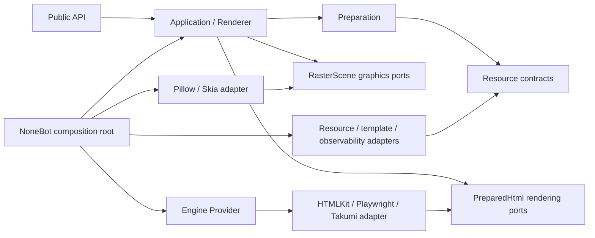
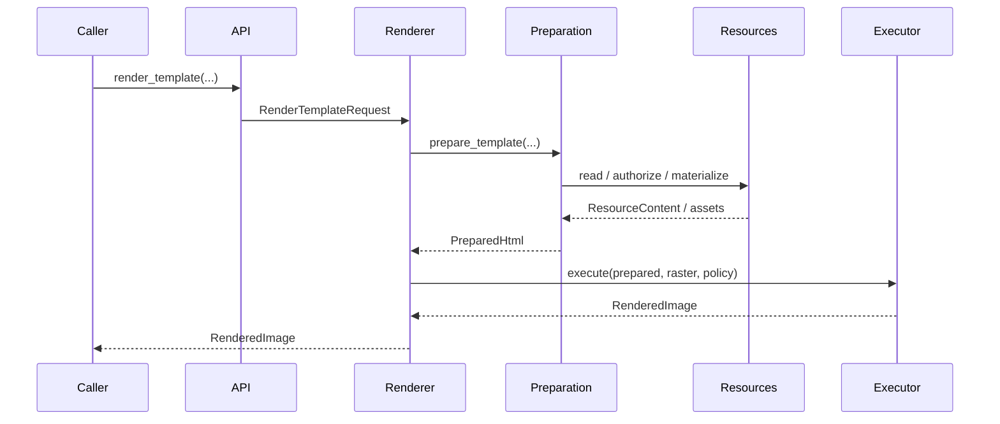
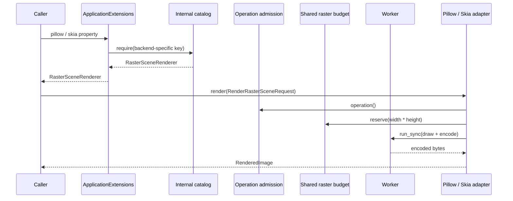

# 分层架构

## 依赖方向

箭头表示“可以依赖”。核心层不反向导入 bootstrap 或 adapters。Pillow/Skia 分支刻意绕开 `EngineProvider`：它们既不是 HTML engine，也不扩张HTMLKit/Playwright/Takumi 的 provider/backend 类型。未选择 Provider 且未启用graphics backend 时，核心对象图不导入或安装任何位图渲染依赖。

## 分层职责

### Public API

把便捷函数转换为 request，并通过默认 `Application` 执行。此层只提供稳定的跨 Provider 语义和 typed artifacts。

### Application

`Application` 聚合 `Renderer`、`ApplicationExtensions`、Preparation/Resource
services 与组合生命周期。`ApplicationExtensions` 用静态属性暴露第一方能力，并把内部 Capability catalog 的 `get(KEY)` / `require(KEY)` 保留给第三方扩展。use case通过构造器得到 preparer、executor 和 observer，不做 discovery。

`Renderer` 与公开的 Preparation/Resource facade 共享 composition 级 operation
admission gate。公开 facade 不暴露内部 raw service，因而调用方在关闭前保留引用也不能绕过 gate。typed Capability 必须由其实现共享同一个 gate，或由自身的 lifecycle
lease 提供等价的拒绝、drain 与关闭后不可复用语义；无状态 Capability 不能省略此边界。

### Preparation

把 HTML、文本、Markdown 与 Jinja 模板转换为 `PreparedHtml`。输出包含stylesheets、assets、execution requirements、结构化的 `DocumentBase`（保存`declared_href` 与 `preparation_base_url`；`declared_href=None` 表示未声明，空字符串表示显式 `<base href="">`）以及 `DocumentStructureSnapshot`（references、linked stylesheets、`<base>` 标签位点与 head/doctype 插入位点），不包含具体引擎对象。`prepare_html` 是唯一解析 markup 的位置；`preparation.document.resolve_document`基于快照以纯字符串拼接产出 canonical markup（`<base>` 规范化、外部 stylesheet 注入），Playwright/Takumi/HTMLKit 与本地 asset materializer 都只消费该结果，执行期不再解析markup 或从中重推导 base；消费方以 `document_base.resolve(fallback_base_url=...)`求最终基址（执行器可提供 fallback document URL）。

### Resource contracts

定义 `ResourceRef`、`ResourceContent`、`ResourceReader`、`LocalAccessPolicy`、`AssetPublisher`、`WorkerExecutor`、`ResourceService` 与收窄的`ProviderResources`。filesystem/package/remote/filehost/Jinja 的实现都在 adapters。Provider 实际收到独立 façade，而不是只靠静态类型隐藏完整 service。

### Provider

Provider 负责专属配置、availability、bootstrap requirements 和 bindings。`resource_strategy(settings)` 在 composition 接线前单独返回不可变策略；`compose()` 只返回 lifecycle、可选 executor 与 typed Capability catalog，不读取NoneBot 全局配置，也不重复携带策略或描述性 metadata。

HTMLKit、Playwright 与 Takumi 都实现同一个 `PreparedHtmlExecutor` port，但能力并不被抹平：无法表示的通用选项和 execution requirement 必须在执行前以稳定错误拒绝，不能静默降级。HTMLKit rc5 的 native 工作无法取消，因此 adapter 在收到取消或超时后仍持有 admission/并发配额并 drain 原生 Future，完成后才传播取消。

### Graphics Capability

`graphics` 定义 immutable `RasterScene`、draw command、encode options 与`RasterSceneRenderer` port。Pillow、Skia 各自实现该 port，并以不同`CapabilityKey` 注册；catalog 只在 composition root 做不相交合并。中立契约不包含 `PreparedHtml`、文本 shaping 或 native object，因此无需也不得伪装成`EngineProvider`。

两个 adapter 接收同一 composition 的 operation admission gate、worker、observer与一个共享 `RasterWorkBudget`。budget 先检查单场景物理像素数，再限制所有已启用graphics backend 的 native work 总并发；draw 与 encode 整段通过 worker 执行，不会阻塞异步事件循环。adapter 在编码边界构造 `RenderedImage` 并翻译 native异常，不把 Pillow/Skia 类型带入公共接口。

### Composition root

唯一负责：

- 读取并校验 `RenderSettings`；
- discovery 并解析 Provider 配置，生成不可变 `ComposedRuntime` plan；
- 创建 observer、worker、资源 reader/decorator、publisher 与 template adapter；
- 用只公开策略、本地授权与 bytes 读取的 façade 组装 `ProviderDependencies`；
- 调用 Provider `compose()`；
- 按 `render.graphics.backends` 组合独立 graphics Capability，并为它们注入共享预算；
- 组装并安装默认 `Application`；
- 把 startup/shutdown 接到 NoneBot driver。

plan 深拷贝 settings 与 Provider 解析结果，并固定 plugin requirements 和`ResourceStrategy`。每次 `build_application()` 都从快照创建新的配置副本、cache、observer、service 与 runtime；Provider 修改某次构建收到的配置不能污染后续构建。

## 渲染调用

Provider 专属调用跳过通用 request 参数扩张：调用方从 `Application.extensions`获取 typed Capability；第一方由静态属性完成内部 catalog 解析，再由 access 对象获取当前 lease。第三方扩展才直接使用 `require(KEY)`。

独立 graphics 调用的数据流是：

调用方选择的是 Pillow 或 Skia 的具体 key，不是会在运行时隐式切换后端的统一 key。矩形使用整数半开区间、按命令顺序做概念上的 source-over；native premultiplication、量化与 encoder 允许不同，因此跨后端 byte/pixel identity 不是契约。

## 生命周期

组合启动顺序：

1. 可选 publisher；
2. Provider lifecycle；
3. 可选 probe。

关闭时先让 application admission gate 永久拒绝新操作并等待在途 use case（包括 preparation）完成，再关闭 Provider，最后清理 publisher/资源服务。`startup()` 与 `aclose()` 幂等；teardown 失败后允许重试，但 admission gate 不重新打开。部分启动失败必须只清理由本次调用成功创建的资源。

Pillow/Skia renderer 使用同一个 admission gate：关闭前已经获准并在共享 budget排队的调用属于在途操作，必须 drain；关闭开始后，从 catalog 预先保留的 renderer引用也会拒绝新调用。当前 graphics adapter 不缓存 decoded image/font/native
surface；将来若引入 native cache，必须保持 backend-local、有界、带显式 disposer，并使用 epoch/identity 防止 clear 后的旧 inflight 回写。

## 允许的进程级状态

渲染对象图中，只有默认 `Application` holder（引用、惰性 factory 与构建锁）可以是进程级状态。Provider discovery 每次从显式列表、第一方映射或 entry
point 解析，不持有 Provider/配置实例缓存。配置、reader、cache、template
environment、observer、publisher 和 lease provider 都属于某个 composition，不得通过模块级 provider seam 注入。

宿主适配层仍可管理本质上属于整个进程的资源，例如 ASGI filehost guard、观测 SDK 的 exporter registry、core 统一加载的 `nonebot-plugin-localstore` 目录设施，以及安装工具使用的 OS signal/process task 状态。`PLAYWRIGHT_BROWSERS_PATH`属于进程环境，由 `PlaywrightDriverSpawnCoordinator`（backend-neutral 同步mutex，经带独立 limiter 的 worker hop 等待，不绑定首个事件循环）作为唯一owner：仅覆盖环境快照与 driver spawn，精确恢复变量，不串行化 browser
lifetime，也不携带 application runtime。`nonebot-plugin-localstore` 必须保持core 宿主依赖，由插件入口统一加载；不得移动到 Playwright extra，也不得由Playwright Provider 通过 `bootstrap_requirements()` 单独声明。这些状态只能封装在adapter/host 边界内，不能成为业务路径读取配置、发现 service 或共享 Provider
runtime 的后门。

## 架构门禁

静态测试同时扫描普通 import、lazy import 与字符串模块路径，禁止核心层触达NoneBot/adapters/bootstrap/telemetry。allowlist 必须为空；新例外意味着边界设计需要重新评估，而不是扩充名单。
