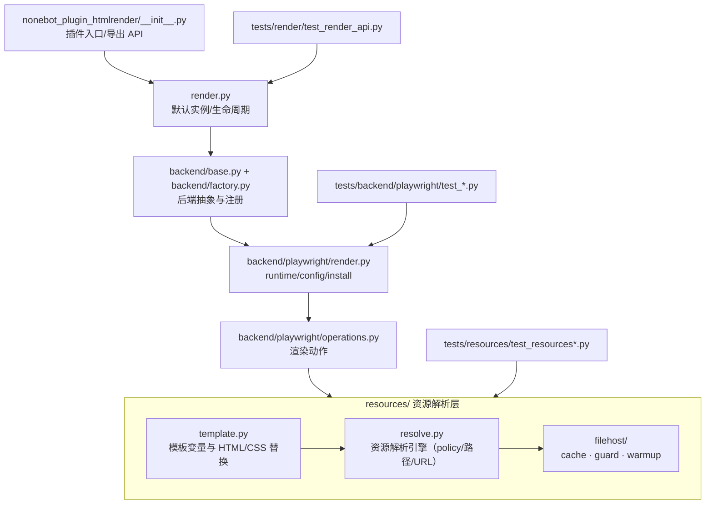
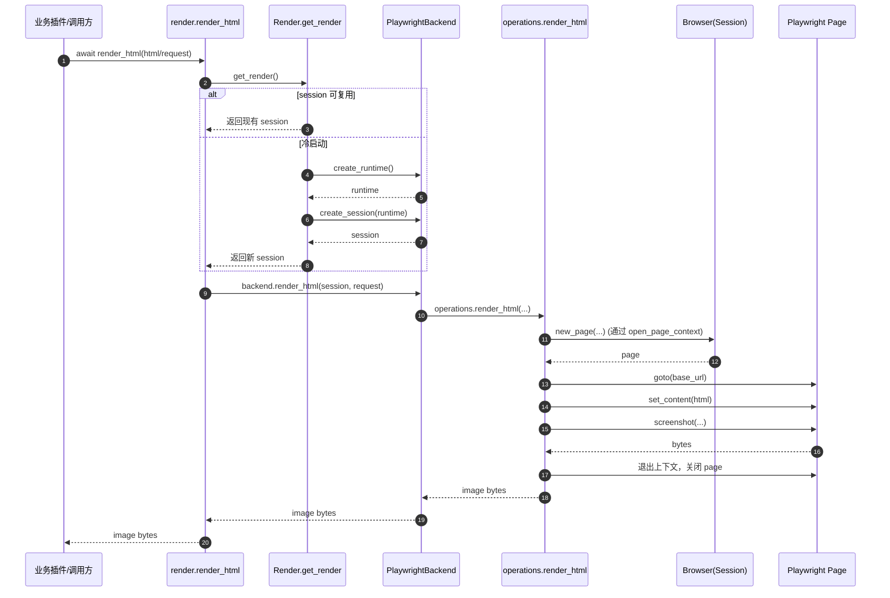
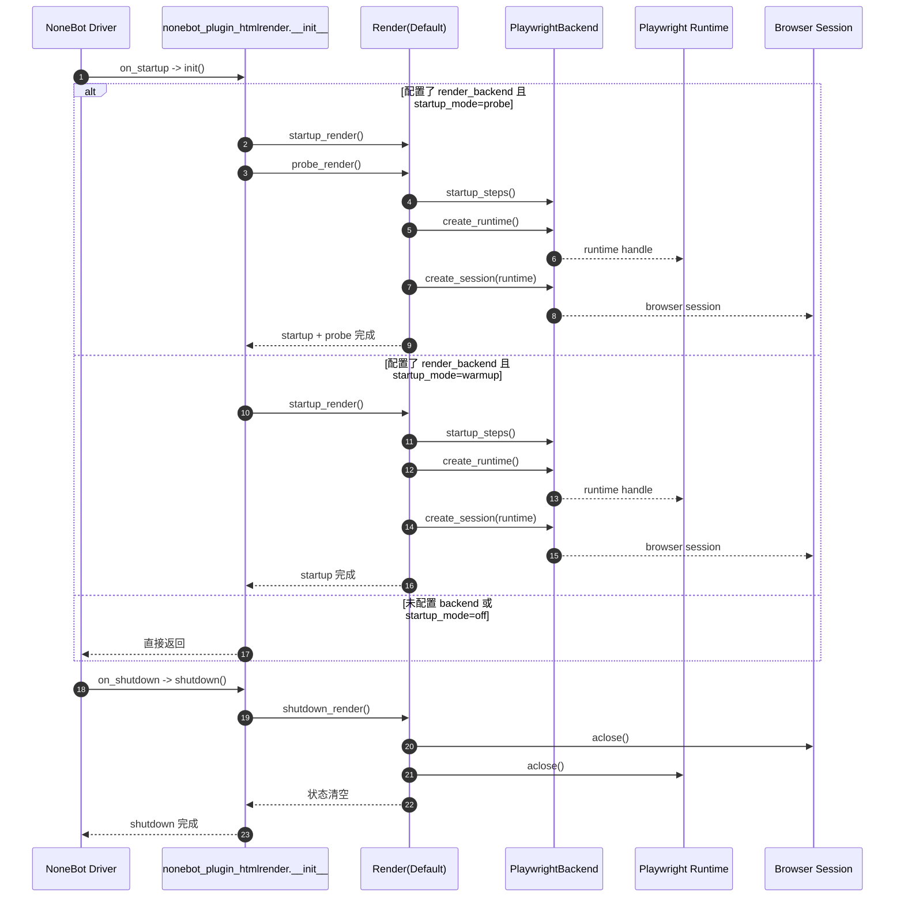

# 分层架构

## 依赖方向

`__init__/render` -> `backend` -> `backend.playwright.*` -> `resources`

!!! info "约束"
    目录拆分只是开始，关键是依赖方向不能反转。

## 五层语义

由上至下：

1. **Render（渲染层）**：面向用户的最高层接口，例如 `render_html`、`render_template`。对 `Backend` 做抽象封装，负责会话复用与默认实例管理。
2. **Backend（后端层）**：具体驱动实现（当前为 Playwright）。负责 `Runtime` 与 `Session` 的创建、销毁、健康检查。
3. **Runtime（运行时）**：一次驱动实例化的产物，对应一个 Playwright 进程或一条远端连接。
4. **Session（会话）**：建立在 `Runtime` 之上的渲染环境。Playwright 后端中通常对应一个 `Browser` 实例。
5. **Context（上下文）**：单次渲染容器。Playwright 后端中对应 `BrowserContext` + `Page`，由 `operations` 模块在每次渲染时按需创建并退出释放。

层次约束：
- 上层只能透过下层暴露的接口操作下层资源，不直接持有更下层对象。
- `Render` 不感知 Playwright 细节；`Backend` 不感知 NoneBot 生命周期。
- 资源解析（`resources/`）作为旁路被 `operations` 调用，不参与渲染主链路的依赖反转。

## 架构图

## 渲染动作时序（HTML -> 图片）

## 插件初始化与关闭时序

## 兼容层原则

- 兼容层只转发旧 API
- 新能力只放在新 API（避免语义漂移）

## 当前实现状态

- backend 抽象层已经落地，扩展面在 `backend/base.py` 与 `backend/factory.py`。
- 当前仓库的正式 backend 实现只有 Playwright。
- `RenderBackend.SKIA`、`PILLOW`、`HTMLKIT` 目前只保留公开枚举与扩展接口，不代表仓库内已经提供对应实现。
