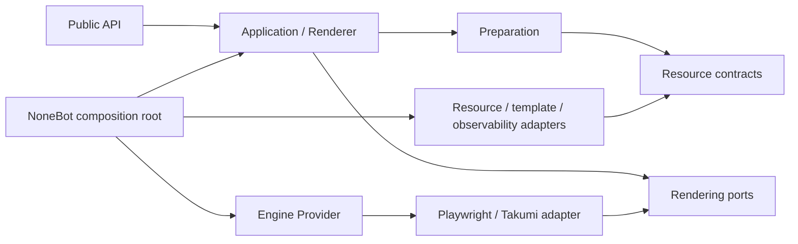
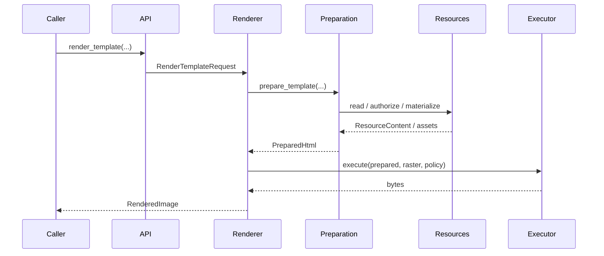

# 分层架构

## 依赖方向

箭头表示“可以依赖”。核心层不反向导入 bootstrap 或 adapters。

## 分层职责

### Public API

把便捷函数转换为 request，并通过默认 `Application` 执行。此层只提供稳定的
跨 Provider 语义和 typed artifacts。

### Application

`Application` 聚合 `Renderer`、Capability catalog、Preparation/Resource
services 与组合生命周期。use case 通过构造器得到 preparer、executor 和
observer，不做 discovery。

### Preparation

把 HTML、文本、Markdown 与 Jinja 模板转换为 `PreparedHtml`。输出包含
stylesheets、assets、资源基址和 execution requirements，不包含具体引擎对象。

### Resource contracts

定义 `ResourceRef`、`ResourceContent`、`ResourceReader`、
`LocalAccessPolicy`、`AssetPublisher`、`WorkerExecutor` 与 `ResourceService`。
filesystem/package/remote/filehost/Jinja 的实现都在 adapters。

### Provider

Provider 负责专属配置、availability、bootstrap requirements 和 bindings。
它返回 executor、lifecycle、ResourceStrategy 与 typed capabilities，不读取
NoneBot 全局配置。

### Composition root

唯一负责：

- 读取并校验 `RenderSettings`；
- discovery 并解析 Provider 配置；
- 创建 observer、worker、资源 reader/decorator、publisher 与 template adapter；
- 调用 Provider `compose()`；
- 组装并安装默认 `Application`；
- 把 startup/shutdown 接到 NoneBot driver。

## 渲染调用

Provider 专属调用跳过通用 request 参数扩张：调用方从 catalog 获取 typed
Capability，再由 Capability 获取当前 lease。

## 生命周期

组合启动顺序：

1. Resource Service / publisher；
2. Provider lifecycle；
3. 可选 probe。

关闭顺序相反：先拒绝新 lease，等待或取消有界的在途操作，关闭 Provider，
再关闭 publisher/资源服务。`startup()` 与 `aclose()` 幂等；部分启动失败必须
只清理由本次调用成功创建的资源。

## 允许的进程级状态

渲染对象图中，只有默认 `Application` holder（引用、惰性 factory 与构建锁）
可以是进程级状态。Provider discovery 每次从显式列表、第一方映射或 entry
point 解析，不持有 Provider/配置实例缓存。配置、reader、cache、template
environment、observer、publisher 和 lease provider 都属于某个 composition，
不得通过模块级 provider seam 注入。

宿主适配层仍可管理本质上属于整个进程的资源，例如 ASGI filehost guard、
观测 SDK 的 exporter registry，以及安装工具使用的 OS signal/process task
状态。这些状态只能封装在 adapter/utility 边界内，不能成为业务路径读取配置、
发现 service 或共享 Provider runtime 的后门。

## 架构门禁

静态测试同时扫描普通 import、lazy import 与字符串模块路径，禁止核心层触达
NoneBot/adapters/bootstrap/telemetry。allowlist 必须为空；新例外意味着边界设计
需要重新评估，而不是扩充名单。
