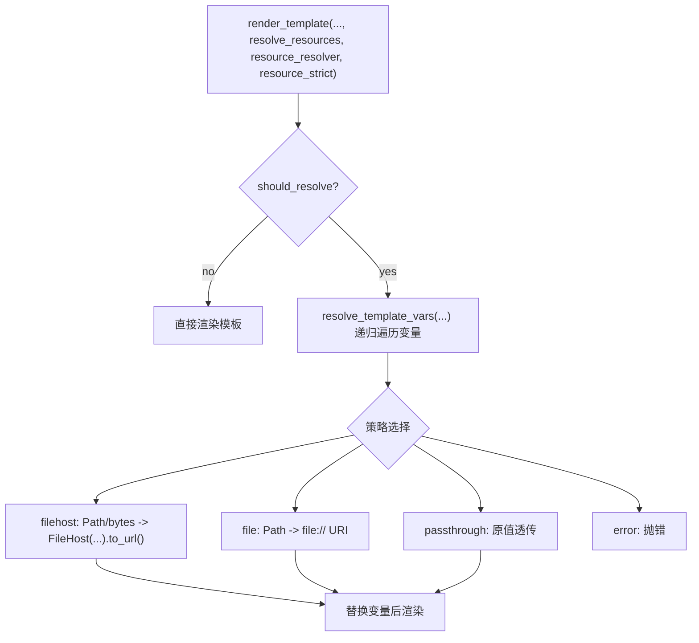
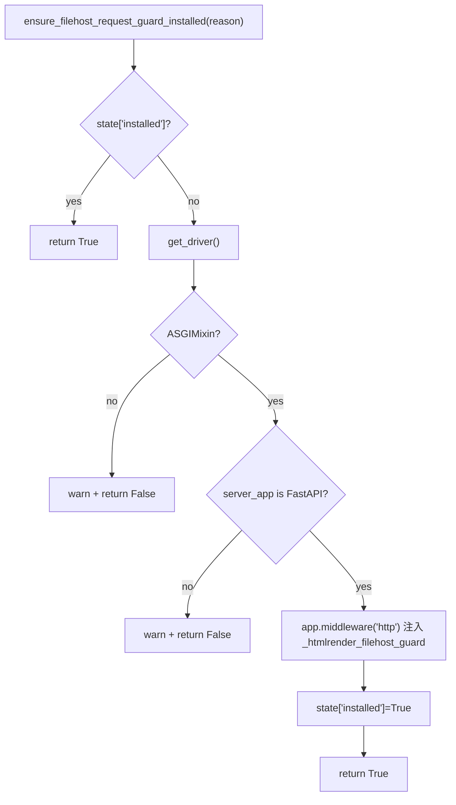
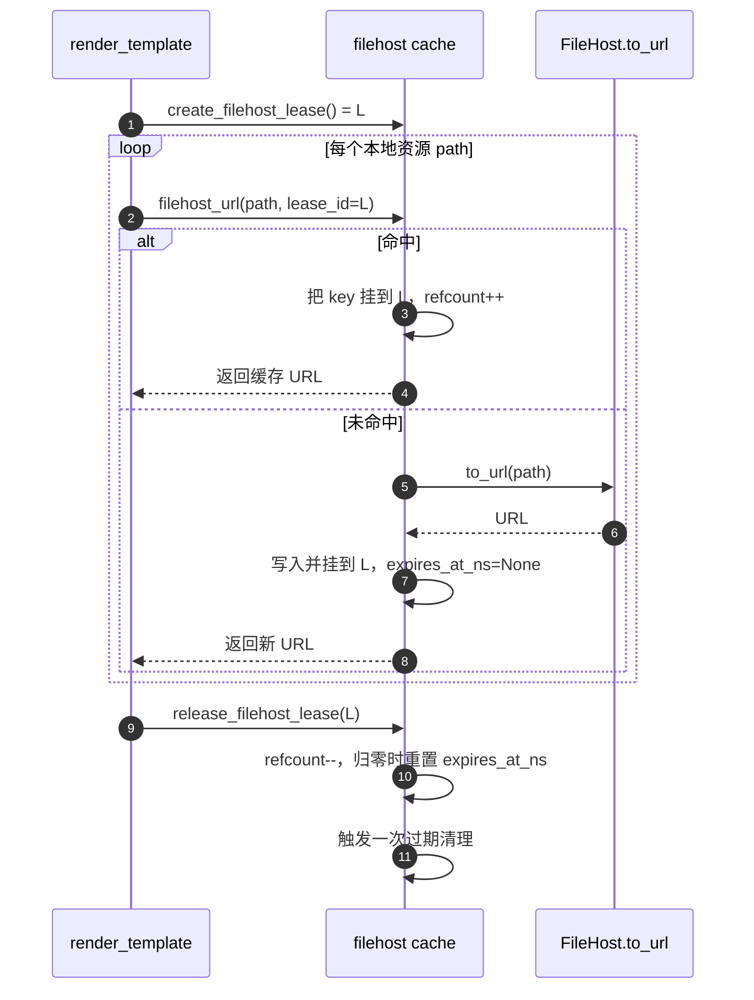
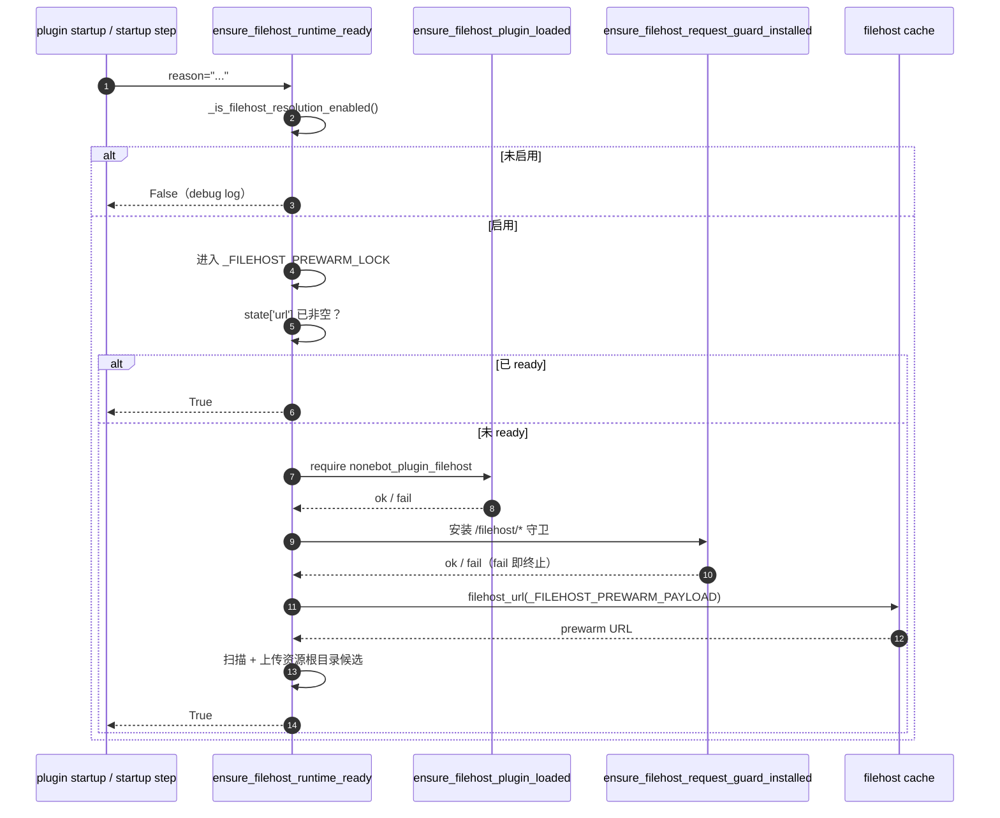

# Filehost 资源解析方案

## 背景

在远程渲染场景中，模板变量里的本地资源（例如 `./assets/a.png`、`/tmp/x.jpg`、`Path(...)`、二进制 bytes）可能无法被远端浏览器直接访问。

- 模板渲染在插件进程
- 资源请求在远端浏览器网络环境
- `file://` 路径在跨主机部署中通常不可达

因此我们在 `render_template` 入口引入“资源解析层”，在渲染前把模板变量中的本地资源转换为远端可访问 URL（优先 filehost）。

## 实现入口与调用链

对应实现位置：

- 解析入口：`nonebot_plugin_htmlrender/backend/playwright/operations.py`
- 资源解析引擎（policy 选择、路径/URL 判断、单值解析）：`nonebot_plugin_htmlrender/resources/resolve.py`
- 模板变量/HTML/CSS 递归解析：`nonebot_plugin_htmlrender/resources/template.py`
- filehost URL 生成与 LRU 缓存：`nonebot_plugin_htmlrender/resources/filehost/cache.py`
- filehost 请求鉴权守卫：`nonebot_plugin_htmlrender/resources/filehost/guard.py`
- filehost 预热与启动编排：`nonebot_plugin_htmlrender/resources/filehost/warmup.py`

## 配置决策模型

### 一级开关

- `resource_resolve_mode = off`：默认关闭解析（除非调用方显式传 `resolve_resources=True` 或显式 resolver）。
- `resource_resolve_mode = auto`：按远程/本地策略自动解析。
- `resource_resolve_mode = strict`：行为同 auto，但失败默认按严格模式处理。

### 二级策略

- 远程模式（存在 `connect_ws.endpoint` 或 `connect_cdp.endpoint`）走 `remote_local_resource_policy`
- 本地模式走 `local_local_resource_policy`

## 具体行为语义

### 值类型识别

可被识别并参与解析的“标量资源”：

- `Path`
- 路径字符串（含绝对路径、相对路径、`~`、Windows 盘符路径等）
- `bytes` / `bytearray` / `BytesIO`

集合类型会被递归处理：

- `dict` / `list` / `tuple` / `set` / 其他 Sequence

显式 URL 会直接透传，不再二次处理：

- `http://`
- `https://`
- `file://`
- `data:`
- `about:`

### 策略执行

| 策略 | 输入 | 输出 | 备注 |
| --- | --- | --- | --- |
| `passthrough` | 任意 | 原值 | 不做变换 |
| `file` | `str/Path` | `file://...` | 非路径类型报错 |
| `filehost` | `Path/bytes/...` | `http(s)://...` | 通过 `nonebot-plugin-filehost` 生成 URL，并执行路径边界校验 |
| `error` | 本地资源 | 抛错 | 用于强制禁止本地资源 |

### filehost 路径边界

- 默认拒绝“任意路径暴露”
- 允许范围默认包含 `template_base`（模板目录）
- 可通过 `render_playwright.filehost_allowed_paths` 增加额外白名单目录
- 仅在 `render_playwright.filehost_allow_any_path=true` 时放开全部路径（高风险，不建议）

### 严格模式与错误处理

- `resource_strict=True`：当前调用强制严格，任一资源解析失败立即抛 `ResourceResolveError`
- `resource_strict=False` 且全局 `resource_resolve_mode=strict`：仍按严格模式执行
- 非严格模式：解析失败仅 warning，保留原值继续渲染

## Filehost 请求头守卫

`resources/filehost/guard.py` 在宿主 FastAPI 的 `/filehost/*` 路径上叠了一层请求头校验中间件，让外部请求拿不到合法 token 就直接拒绝——避免 filehost 暴露的 URL 被任意网络方扫到后随意拉取。

### 内部数据结构

| 名称 | 形态 | 用途 |
| --- | --- | --- |
| `_FILEHOST_GUARD_STATE` | `dict[str, str \| bool \| None]` | 持 `installed`（中间件是否已注入）与 `token`（当前期望的 header 值） |
| `_FILEHOST_FALLBACK_INSTANCE_ID` | `str` | 模块加载时一次性生成的 `uuid4:<hex>`，作为派生 token 的最末备胎 |

state 字典在每次 `_get_request_guard_header_config(...)` 时按当前配置刷新——header 名/token 都可以热替换，无需重启进程。

### Token 派生

`_get_request_guard_header_config()` 按优先级返回 `(header_name, token)`：

1. **显式 token**：`render_playwright.filehost_request_header_value` 非空时，去 `strip()` 后直接作为 token 写入 state
2. **派生 token**：`sha256(salt + ":" + device_id).hexdigest()`
    - `salt` = `render_playwright.filehost_request_header_salt`（默认 `nonebot-plugin-htmlrender:filehost:guard:v1`）
    - `device_id` 优先 `machineid.id()`（来自可选依赖 `py-machineid`）；失败回退 `mac:<uuid.getnode():012x>`；再失败回退到模块加载时的 `_FILEHOST_FALLBACK_INSTANCE_ID`
    - 设备级别不变 → 同一台机器多次启动得到同一个 token，便于持久化外部反向代理白名单

生成端（`get_filehost_request_headers()`，给 Playwright 渲染端注入页面请求头）与消费端（中间件 `_htmlrender_filehost_guard`）共享同一派生规则——一次配置变更两端同时生效。

### 中间件安装

`ensure_filehost_request_guard_installed(*, reason)` 是幂等的安装入口：

中间件运行时对每个 `/filehost/*` 请求重新读取一次 header 配置，对比 token：

- token 缺失或不匹配 → `403 Plain Text`
- 匹配 → 透传给 `call_next`

### 公共 API

| API | 形态 | 用途 |
| --- | --- | --- |
| `get_filehost_request_headers()` | sync | 渲染端调用，得到注入页面请求的 header 字典；filehost 解析未启用时返回空字典 |
| `ensure_filehost_request_guard_installed(*, reason)` | sync | 安装中间件，幂等；失败仅 warning，不抛 |

`reason` 字段贯穿日志便于追因，常见取值：`plugin_startup`（插件启动阶段）、`playwright_startup`（后端启动 step）。

## Filehost 缓存与租约

`resources/filehost/cache.py` 在 filehost URL 之上叠了一层进程级缓存，让重复出现的本地资源（同一张头像、同一份 CSS）只上传一次。

### 内部数据结构

三个进程级共享映射，全部受同一把 `anyio.Lock` 保护，避免并发渲染时的竞态：

| 映射 | 形态 | 用途 |
| --- | --- | --- |
| `_FILEHOST_RESOURCE_CACHE` | `dict[str, _CacheEntry]` | 文件绝对路径 → 已上传的 URL 与命中签名 |
| `_FILEHOST_LEASES` | `dict[str, set[str]]` | 渲染 lease → 该 lease 持有的 cache key 集合 |
| `_FILEHOST_RESOURCE_INFLIGHT` | `dict[str, _InflightResourceUpload]` | 正在上传中的占位项，用于并发去重 |

`_CacheEntry` 字段：

| 字段 | 含义 |
| --- | --- |
| `url` | filehost 生成的可访问 URL |
| `mtime_ns` / `size` | 命中签名，文件被改动后强制重新上传 |
| `hits` / `last_access_ns` | 访问统计 |
| `lease_ref_count` | 当前持有该 key 的 lease 数量 |
| `expires_at_ns` | 计算出的过期时间；持有 lease 时为 `None`（永不过期） |

### 命中条件

`filehost_url(value, lease_id=...)` 仅对 `Path` 类型走缓存路径。命中要求三项同时满足：

1. `str(path.resolve())` 与缓存 key 相等
2. 文件 `st_mtime_ns` 与缓存一致
3. 文件 `st_size` 与缓存一致

任一条件失败按未命中处理，进入"上传去重"流程重新生成 URL。`bytes` / `bytearray` / `BytesIO` 不走缓存，每次直接 `FileHost(...).to_url()`——bytes 对象没有稳定 key 可索引，强制缓存反而引入伪命中风险。

### TTL 与驱逐

- TTL 由 `render_playwright.filehost_cache_ttl_seconds` 控制，默认 300 秒
- 命中时刷新 `expires_at_ns = now_ns + TTL`（仅在无 lease 持有时；持有 lease 期间一直是 `None`）
- 驱逐函数 `_evict_expired_resources_locked` 在以下时机触发：
  - 每次 `filehost_url(...)` 入口（先 evict 再查表）
  - `release_filehost_lease(...)` 释放 lease 后
  - 用户主动调用 `prune_filehost_cache()`
- `lease_ref_count > 0` 的条目不参与驱逐——单次渲染期间钉住的资源不会被并发请求的 TTL 检查抢先回收

### Lease（租约）

Lease 解决"渲染中途上传的 URL 被并发请求的 TTL 检查截胡而被驱逐"问题：

实际位置：`backend/playwright/operations.py::render_template` 在解析资源前 `create_filehost_lease()`，在 `finally` 分支 `release_filehost_lease(lease_id)`。期间命中或新增的所有 key 都被挂到该 lease 上。

### 上传并发去重

同一 key 在上传中时，后续请求不会触发第二次 `to_url()`：

- 第一个未命中的请求成为 owner，写入 `_InflightResourceUpload(event=anyio.Event())` 占位
- 后续同 key 的请求看到 inflight 项后 `await event.wait()`
- 上传成功：owner 写 cache + 设置 `inflight.url`，`event.set()` 唤醒等待者
- 上传失败：owner 把异常写入 `inflight.error`，等待者读取后一并抛出

效果：同一文件被并发渲染调用引用时只触发一次 filehost 上传，避免对 filehost 服务的放大调用。

### 公共 API

| API | 形态 | 用途 |
| --- | --- | --- |
| `filehost_url(value, *, lease_id=None)` | async | 主入口，按 value 类型选择上传或缓存命中 |
| `create_filehost_lease()` | sync | 创建 lease，返回 lease id |
| `release_filehost_lease(lease_id)` | async | 释放 lease 并触发一次驱逐 |
| `prune_filehost_cache()` | async | 主动清理过期条目（长时间空闲后想立刻回收内存） |

均从 `nonebot_plugin_htmlrender.resources.filehost` 导出。普通使用走 `render_template(resolve_resources=True)` 自动管理 lease；自定义资源解析器可通过 `lease_id` 参数透传以共享渲染调用的 lease。

## Filehost 预热与 runtime 准备

`resources/filehost/warmup.py` 把"装好守卫 + 上传一次固定 payload + 扫描资源根目录"三件事编排成一个幂等的 ready 流程，让首次渲染调用不必承担 filehost 冷启动开销。

### 内部数据结构

| 名称 | 形态 | 用途 |
| --- | --- | --- |
| `_FILEHOST_PREWARM_LOCK` | `anyio.Lock` | 串行化 ready 流程，并发请求只跑一次 |
| `_FILEHOST_PREWARM_STATE` | `dict[str, str \| None]` | `{url: ready 后持久化的 prewarm URL, last_error: 最近一次失败原因}`；`url` 非空即视为 ready |
| `_FILEHOST_PREWARM_PAYLOAD` | `bytes` | 固定常量字节串 `nonebot-plugin-htmlrender:filehost-prewarm`，避免每次启动产生不同 payload 干扰 filehost 内部去重 |
| `_FILEHOST_REGISTERED_ROOTS` | `set[Path]` | 渲染过程中动态注册的资源根目录，参与目录预热扫描 |
| `_TEMPLATE_FILE_SUFFIXES` | `set[str]` | 排除的模板源文件后缀（`.html` / `.htm` / `.jinja` / `.jinja2` / `.tmpl` / `.tpl`），防止模板源被 filehost 公开 |

### Ready 流程

`ensure_filehost_runtime_ready(*, reason)` 是 ready 入口，被插件 startup 与后端 startup step 共用：

任何一步失败：写入 `state["last_error"]` 并 warning 返回 False；下一次调用会重新尝试（`state["url"]` 仍是 `None`）。

### 目录预热

候选集合 = `cfg.filehost_allowed_paths` ∪ `cfg.filehost_prewarm_paths` ∪ `_FILEHOST_REGISTERED_ROOTS`，去重后保留存在的目录。

扫描行为（`_collect_prewarm_candidates`）：

- `Path.rglob("*")` 递归
- 跳过非文件与模板源文件（`_TEMPLATE_FILE_SUFFIXES`）
- 按 `cfg.filehost_prewarm_extensions` 后缀白名单筛选；空集合 = 不限制后缀
- 命中数达到 `cfg.filehost_prewarm_max_files`（默认 256）即停

上传行为（`_prewarm_one`）：

- `anyio.create_task_group()` 并发，`CapacityLimiter(min(8, len(candidates)))` 限同时上传数
- 每个候选调 `filehost_url(candidate)`（无 lease，写入 cache 后等 TTL 自然过期）
- 单个文件失败仅 warning，不影响其他文件

### 资源根目录注册

`register_filehost_resource_root(path)` 把模板/资源目录加入 `_FILEHOST_REGISTERED_ROOTS`：

- `backend/playwright/operations.py::render_template` 每次调用都会注册 `request.template.template_path`
- 注册集合在下一次 ready 重做时被采用——首次启动后新增的模板目录会在下次 prewarm 重置时被覆盖

### 公共 API

| API | 形态 | 用途 |
| --- | --- | --- |
| `ensure_filehost_runtime_ready(*, reason)` | async | ready 入口；插件 startup 与后端 `startup_steps` 第 4 步都会调 |
| `ensure_filehost_plugin_loaded(*, reason, strict=False)` | sync | 单独要求 filehost 插件就绪；`strict=True` 时失败抛错 |
| `register_filehost_resource_root(path)` | sync | 注册新的资源根，参与下一次预热 |
| `get_filehost_prewarm_status()` | sync | 返回 `{ready, url, last_error, cached_resources, active_leases}` 字典；可暴露给观测/调试端点 |

观测面：`get_filehost_prewarm_status()` 同时暴露 `cached_resources`（cache 条目数）与 `active_leases`（活跃 lease 数），与「Filehost 缓存与租约」章节的内部状态联动。

## 远程安全行为（PNA 预检查）

在远程模式下，`render_template` 会对模板变量中的 `http(s)` 资源做预检查：

- 若检测到本地/私网目标（如 `localhost`、私网 IP、短主机名、`.local`）且与 `pages.base_url` 非同源，会提示 PNA 风险
- `resource_strict=True` 时该预检查可直接抛错；否则 warning 后继续

这用于尽早发现“远程浏览器可连通性”问题，而不是等页面截图阶段才失败。

## 与兼容层的边界

兼容入口（如 `template_to_pic`）不接入资源解析参数。  
若传入 `resolve_resources` / `resource_resolver` / `resource_strict`，会直接报错并引导改用新 API：`render_template`。
