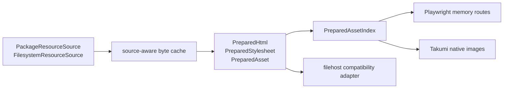

# 资源准备与传输方案

v0.7.2 将“从哪里读取资源”“如何缓存 bytes”“后端如何消费资源”拆成三个独立边界。远程 Playwright 默认通过内存资产桥传输；filehost 只在调用方显式选择时作为 HTTP 兼容适配器。

## 分层与不变量

必须保持以下不变量：

1. `PreparedHtml.html` 永远是原始浏览器文档；后端不能依赖另一个去除 `<style>` 的重复表示。
1. `base_url` 只表示资源解析基址，不触发浏览器导航；导航由 `document_url` 单独表达。
1. `PreparedStylesheet(css, base_url, embedded, media)` 保留样式顺序、来源基址与条件语义。
1. `PreparedAsset.source` 是文档中的资源标识；`PreparedAssetIndex` 同时支持 exact key 与相对 `base_url` 规范化匹配，并拒绝冲突。
1. package resource、进程内 cache 和 `PreparedAsset` 都不复制到 localstore。

## Resource source

### Package resources

内置 text / Markdown 模板由 `PackageResourceSource` 表达，通过 `importlib.resources` 读取，并由 Jinja `PackageLoader` 加载。缓存 identity 是 `(package, logical_name)`；已安装 distribution 中的 package resources 视为 immutable。

模板文件属于 wheel/`RECORD`，卸载包时随 distribution 删除。项目不实现 uninstall hook、模板复制、localstore purge 或用户覆盖目录，避免 wheel 与外部副本形成两个真源。

### Filesystem resources

用户模板与外部资源由 `FilesystemResourceSource` 表达，Jinja 使用 `FileSystemLoader`。缓存 identity 是规范路径与当前 revision；`revalidate` 会重新检查文件状态并在内容变化后发布新 generation。

Jinja environment cache 按 source/loader identity、扩展与 filter identity 隔离，不要求每种 loader 都能还原为实体 `Path`。

## 共用 byte cache

package 与 filesystem source 共享同一个全局 LRU 预算，而不是各自获得一份完整配额。该预算同时限制 entry 数与 byte 权重，统一统计混合命中/驱逐；每种 source 仍对自己的 key 使用 singleflight。失效正确性由 generation 保证：

- `refresh`、`invalidate` 与 `clear` 都推进对应 key 或全局 epoch；
- 旧 generation 的 inflight 即使随后成功，也不得回填新 generation；
- owner 的成功、异常和取消都在同一发布边界中写入结果并唤醒 waiter；
- package resource 永久 immutable，filesystem resource 按 revision 与 revalidate window 检查。

这些 cache 只存在于进程内，不写入 `render_cache_path`。

## Token-aware 引用扫描

HTML scanner 基于 token 结构识别 `src`、`href`、`poster`、`srcset` 与 `xlink:href`；CSS scanner 识别 `url()` 与 `@import`，并跳过 comment 与字符串。禁止重新引入对整份 HTML/CSS 做全局正则替换的实现，因为它会误判 `<script>` 文本、注释或带转义的 token。

`prepare_markdown` 分别保留 Markdown 文件与 CSS 文件的来源基址。内存 Markdown 没有基址却引用相对文件时，严格模式报错，非严格模式 warning 后保留原值。

Jinja 图片变量在进入可渲染 `PreparedHtml` 前也必须保留 side channel：`Path` 规范为跨平台 `file://` URI；`bytes`、`bytearray` 与 `BytesIO` 按 SHA-256 去重为带媒体类型的 `PreparedAsset`。只返回 HTML 字符串的 API 不执行该 staging，因为它无法携带资产 bytes。

## Playwright 内存资产桥

Playwright 将 prepared document 翻译成 `BrowserLoadPlan(html, document_url, base_href, assets)`：

1. 按 `PreparedAsset.data` 的 SHA-256 生成 `https://htmlrender.invalid/.htmlrender/assets/<digest>` 合成地址；
1. 改写文档和 stylesheet 中实际匹配的引用；
1. 在当前 Page 安装 route，以 `fulfill` 返回 bytes、媒体类型、缓存头和 CORS header；
1. 仅当 `document_url` 非空时调用 `page.goto()`；
1. 调用 `page.set_content(html)`，渲染完成后随 Page 释放 routes 与 assets。

当 prepared document 没有显式 `base_url` 且 `document_url` 是 HTTP(S) 时，load plan 可把导航 URL 作为浏览器相对网络资源的 fallback，但不得把它写回 `PreparedHtml.base_url`。这保留了 v0.7.1 导航兼容，同时维持 preparation 与 navigation 的结构边界。

`AUTO + MEMORY` 是远程有效默认策略。`PASSTHROUGH` 只供明确使用同路径共享卷的部署；`ERROR` 在发现本地引用时立即失败。

Playwright 必须保留原始 `<style>` 的位置和 `media` 语义。Takumi 从同一个 prepared model 消费 CSS；如果无法表达条件 stylesheet，则明确抛出 `TakumiUnsupportedError`。

## Filehost 兼容适配器

filehost 适用于确实需要 HTTP URL 或既有 `/filehost/*` 网关的部署，不是远程默认链路。

### 内容身份与 singleflight

适配器把 `Path`、`str` path、`bytes`、`bytearray` 与 `BytesIO` 都归一成一致 bytes 快照，以 SHA-256 digest 作为 blob identity：

- 路径读取前后校验 device、inode、size、mtime 与 ctime，连续变化时失败；
- 不同路径的相同内容复用 URL mapping；
- 相同 digest 并发上传只产生一个 owner；
- 上传、mapping 发布与 waiter 唤醒处在同一个取消安全异常边界；
- lease 绑定 blob revision，而不是容易变化的路径别名。

### URL mapping TTL

`filehost_cache_ttl_seconds` 只定义 htmlrender 持有的 **URL mapping TTL**：

- 无活跃 lease 时，命中刷新 mapping TTL；
- 活跃 lease 会钉住具体 blob mapping，直到本次渲染释放；
- mapping 过期会释放 htmlrender 的索引，不等于删除物理文件。

`nonebot-plugin-filehost` 自己管理进程级临时目录与物理文件生命周期。htmlrender 不访问其私有文件字段，也不承诺逐文件删除、渲染结束即删除或 TTL 到期即安全擦除。

### 请求守卫

显式启用 filehost 时，bootstrap 才加载可选依赖并尝试给 `/filehost/*` 安装请求头守卫。路径必须位于模板根或 `filehost_allowed_paths`；`filehost_allow_any_path=true` 会绕过这条边界，不应在非隔离环境启用。

守卫不可用时不会伪装为安全成功：启动日志会报告 ASGI/FastAPI 不满足。生产部署应改用内存桥，或在外部网关完成等价鉴权。

### 指标

filehost 只输出低基数统计：upload bytes、dedup hits、active mappings、active leases 与 cleanup capability。不得记录路径、URL、digest、资源内容或模板名。exporter 失败必须隔离，不能改变渲染结果。

## 生命周期与存储边界

| 对象                          | 存储位置                       | 生命周期                |
| ----------------------------- | ------------------------------ | ----------------------- |
| 内置模板                      | wheel package files / `RECORD` | distribution 安装到卸载 |
| package/filesystem byte cache | Bot 进程内存                   | 进程或显式 clear        |
| Jinja environment cache       | Bot 进程内存                   | 进程或显式 invalidate   |
| `PreparedAsset`               | 一次 prepared/render 调用内存  | Page / native 调用完成  |
| Playwright synthetic route    | 当前 Page                      | Page 关闭               |
| filehost URL mapping          | Bot 进程内存                   | mapping TTL / lease     |
| filehost 物理文件             | filehost 进程级临时目录        | 由 filehost 自己管理    |

`render_cache_path` 与 `render_config_path` 当前是保留配置，没有模板消费者。架构层不提供 uninstall hook、内置模板复制、localstore 清理或用户覆盖目录。
