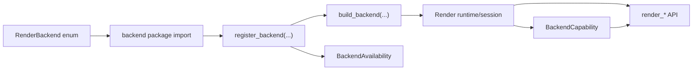

# 渲染后端开发指南

这份文档回答的不是“backend 抽象是什么”，而是更实际的问题：

- 如果现在要在仓库里接入一个 backend，最小落地步骤是什么
- 哪些地方已经抽象好了，哪些地方仍然带有 `playwright` 假设
- 什么时候只需要实现 `Backend`，什么时候还要继续改插件启动与资源链路

如果你还没看协议本身，先读 [自定义 Backend 指南](custom-backends.md)。

!!! warning "当前状态"
    当前仓库正式支持的 backend 仍然只有 `playwright`。`skia`、`pillow`、`htmlkit` 等枚举值代表公开扩展点，不代表已经存在可用实现。

## 先下结论

把目标 backend 接进当前仓库，至少要完成四件事：

1. 给 `RenderBackend` 增加明确枚举值
2. 提供一个可注册的 backend 实现，并声明真实 capability
3. 让工厂层能构建它，并能给出可诊断的 availability 信息
4. 审查插件入口、资源预热、兼容层与测试分层里是否仍有 `playwright` 特判

只有前两步完成，代码才“能编起来”。  
四步都完成，才算真正可维护。



## 开发前判断：你在接哪一类 backend

先别急着建目录。先判断目标 backend 属于哪一类：

=== "HTML engine backend"

    典型是浏览器或 WebView 语义后端，能处理 HTML、Markdown、template、元素截图。

    适合声明：

    - `RENDER_CONTEXT`
    - `HTML_RENDER`
    - `TEXT_RENDER`
    - `MARKDOWN_RENDER`
    - `TEMPLATE_RENDER`
    - `TEMPLATE_HTML_RENDER`
    - `HTML_ELEMENT_CAPTURE`

=== "Raster backend"

    典型是 Skia / Pillow 一类，仅负责位图绘制，不天然具备 DOM、CSS、模板页面上下文。

    适合声明：

    - `RASTER_RENDER`

这会直接决定 capability 应该如何声明：

- 如果没有页面上下文，就不要声明 `RENDER_CONTEXT`
- 如果不能稳定支持 HTML/CSS 语义，就不要声明 `HTML_RENDER`
- 如果只做位图输出，应优先考虑 `RASTER_RENDER`

不要为了让上层 API “看起来都能用”而虚报能力。`Render` 会按 capability 暴露入口，声明错了，错误就会延后到运行期。

| 判断问题 | 更可能的路线 |
| --- | --- |
| 是否需要 CSS layout、字体回退、DOM 查询和元素截图 | HTML engine backend |
| 是否只需要把结构化数据画成图片 | Raster backend |
| 是否需要复用 template / filehost / resource resolver | 通常是 HTML engine backend |
| 是否可以不创建页面上下文 | 通常是 Raster backend |

## 推荐目录骨架

当前 Playwright 实现放在 `nonebot_plugin_htmlrender/backend/playwright/`。  
目标 backend 不要求复制同样的文件数，但建议保留相同的职责切分：

```text
nonebot_plugin_htmlrender/backend/<backend_name>/
├── __init__.py
├── render.py
├── config.py            # optional
├── models.py            # optional
├── operations.py        # optional
└── runtime.py           # optional
```

最低要求通常只需要一个 `render.py`，其中包含：

- backend 类本身
- runtime / session 创建与关闭逻辑
- availability checker
- `register_backend(...)`

当渲染动作已经开始积累复杂度，再把操作拆到 `operations.py`。  
不要在第一步就为“将来可能有很多文件”做目录体操。

## 最小落地步骤

!!! abstract "交付检查清单"
    - [ ] `RenderBackend` 已有稳定枚举值
    - [ ] backend 模块会被导入并完成注册
    - [ ] availability checker 不产生重型副作用
    - [ ] `capabilities` 只声明真实能力
    - [ ] runtime/session 能被 `Render` 层统一关闭
    - [ ] 工厂层、生命周期、能力映射测试已覆盖
    - [ ] 插件启动、资源解析、兼容层中的 `playwright` 特判已审查

### 1. 增加 backend 枚举

位置：`nonebot_plugin_htmlrender/consts.py`

把目标 backend 放进 `RenderBackend`，让配置层、工厂层和状态查询能引用同一标识。

```python
class RenderBackend(StrEnum):
    SKIA = "skia"
    PLAYWRIGHT = "playwright"
    PILLOW = "pillow"
    HTMLKIT = "htmlkit"
    MY_BACKEND = "my_backend"
```

这里的值会直接暴露给 `.env` / `nonebot.init(...)`，所以名称要稳定、可读、不要带实现细节。

### 2. 实现 backend 类

位置建议：`nonebot_plugin_htmlrender/backend/<backend_name>/render.py`

最小骨架如下：

```python
from contextlib import asynccontextmanager
from collections.abc import AsyncIterator

from nonebot_plugin_htmlrender.backend.base import (
    BackendCapability,
    RenderRuntime,
    RenderSession,
)
from nonebot_plugin_htmlrender.backend.factory import (
    BackendAvailability,
    register_backend,
)
from nonebot_plugin_htmlrender.consts import RenderBackend

class MyBackend:
    backend = RenderBackend.MY_BACKEND
    capabilities = frozenset(
        {
            BackendCapability.RASTER_RENDER,
        }
    )

    def startup_steps(self) -> tuple:
        return ()

    async def create_runtime(self) -> RenderRuntime:
        handle = object()

        async def _aclose() -> None:
            return None
        return RenderRuntime(
            backend=self.backend,
            handle=handle,
            _aclose=_aclose,
        )

    async def create_session(
        self,
        runtime: RenderRuntime,
        **kwargs: object,
    ) -> RenderSession:
        del kwargs
        session_handle = object()

        async def _aclose() -> None:
            return None
        return RenderSession(
            runtime=runtime,
            handle=session_handle,
            _aclose=_aclose,
        )

    def is_alive(self, session: RenderSession) -> bool:
        return session.handle is not None

    @asynccontextmanager
    async def get_render_context(
        self,
        session: RenderSession,
        **kwargs: object,
    ) -> AsyncIterator[object]:
        del session, kwargs
        yield object()

def is_my_backend_available() -> BackendAvailability:
    return BackendAvailability(available=True)

register_backend(
    RenderBackend.MY_BACKEND,
    MyBackend,
    availability_checker=is_my_backend_available,
)
```

这里真正关键的不是样板代码，而是三个约束：

- `RenderRuntime` 和 `RenderSession` 必须都能独立关闭
- `is_alive()` 必须表达真实可复用性，而不是永远返回 `True`
- `capabilities` 只填已经落地的能力

??? note "为什么 runtime 和 session 要拆开"
    `RenderRuntime` 表达 backend 级资源，例如驱动进程、全局连接或共享上下文。`RenderSession` 表达可复用的渲染会话，例如浏览器实例、渲染 worker 或图形上下文。拆开之后，`Render` 层才能在 session 失效时重建会话，同时保留仍然可用的 runtime。

### 3. 决定是否实现 HTML family

如果 backend 要支持：

- `render_html`
- `render_text`
- `render_markdown`
- `render_template`
- `render_template_html`
- `capture_html_element`

那么它还必须满足 `SupportsHtmlRenderBackend` 这组方法契约。  
这通常意味着你不仅要能“出图”，还要定义：

- 单次渲染上下文是什么
- 如何处理页面生命周期
- 模板渲染与资源解析放在哪一层
- 元素级截图是否存在等价语义

如果这些语义并不成立，就不要勉强套 `HTML_RENDER` 路线。

| 用户 API | backend 需要提供的语义 |
| --- | --- |
| `render_html` | 解析 HTML/CSS 并输出截图 |
| `render_text` | 把文本排版为可截图内容 |
| `render_markdown` | Markdown -> HTML -> image 的完整链路 |
| `render_template` | 模板变量、资源解析、页面渲染和截图 |
| `render_template_html` | 只输出模板渲染后的 HTML |
| `capture_html_element` | 打开页面并定位指定元素截图 |

### 4. 提供 availability checker

位置：和 backend 注册代码放在一起即可。

`BackendAvailability` 的目的不是做健康监控，而是在真正启动前尽早回答：

- 依赖包是否存在
- 本地二进制或系统库是否存在
- 配置组合是否自洽
- 当前平台是否支持

推荐把“静态可判定”的失败都放在这里，例如：

- 缺少第三方依赖
- 引擎只支持 Linux，但当前平台是 macOS
- 必填配置项为空

不要把 availability checker 写成“尝试真正启动一次浏览器/进程”。  
那会把轻量状态查询变成有副作用的 warmup。

!!! tip "availability 的边界"
    availability checker 适合回答“当前环境是否具备启动条件”。真正启动、连接和探测应交给 `startup_steps()`、`create_runtime()` 或 `probe_render()`。

### 5. 接入导入路径

仅仅写完 `register_backend(...)` 还不够。  
你必须确保对应模块会被导入，否则注册逻辑不会执行。

当前仓库的正式实现通过包导入触发注册。接入 backend 时至少要检查：

- backend 模块是否会在插件导入链路中被 import
- `registered_render_backends()` 是否能看到它
- `list_render_backend_statuses()` 是否能报告它的状态

如果模块永远没有被导入，那么 `build_backend(...)` 最终只会报“backend 未注册”。

## 当前仓库里的非对称接缝

这里是接入 backend 时最容易踩的坑。  
协议层已经抽象了，但插件层还没有完全去掉 `playwright` 假设。

| 位置 | 当前假设 | 目标 backend 需要判断 |
| --- | --- | --- |
| `__init__.py` | 启动时只为 `playwright` 预热 filehost | 目标 backend 是否也需要 startup bootstrap |
| `_bootstrap.py` | 仅在 `playwright` 显式选择 filehost 策略时做导入期 filehost bootstrap | 目标 backend 是否需要额外 bootstrap |
| `resources/` | 资源解析主要服务 HTML/template 渲染 | 目标 backend 是否需要复用资源解析 |
| `_compat.py` / `browser.py` | 历史接口偏向 Playwright 语义 | 旧接口是否应支持目标 backend |

### 插件启动阶段的 `playwright` 特判

位置：

- `nonebot_plugin_htmlrender/__init__.py`
- `nonebot_plugin_htmlrender/_bootstrap.py`

当前行为里至少有这些分支只对 `RenderBackend.PLAYWRIGHT` 生效：

- filehost request guard 安装（仅 filehost 策略启用时）
- filehost runtime 预热（仅 filehost 策略启用时）
- shutdown 时清理 Playwright 环境变量

这意味着：

- 如果目标 backend 不依赖这些逻辑，可以保持不动
- 如果它也需要 import-time bootstrap 或 shutdown cleanup，就要为它补一条对称路径
- 如果它复用 filehost，但不走 Playwright backend，就需要重新审视资源预热应该挂在哪一层

### 资源解析链路目前偏向 HTML family

位置：

- `docs/maintainers/architecture/filehost-resource-resolution.md`
- `nonebot_plugin_htmlrender/resources/`
- `nonebot_plugin_htmlrender/backend/playwright/operations.py`

现在的资源解析与 filehost 协作主要围绕 template / page render 展开。  
如果目标 backend 不是页面语义后端，这一层可能完全不需要；如果是 HTML engine，则需要判断：

- 是否复用现有 `resources/` 解析规则
- 是否仍然使用 filehost 作为远程本地资源桥接
- 是否要提供新的 resource config provider

不要把资源解析硬塞进 backend 基类。它目前仍然是具体实现选择。

### 兼容层默认仍然偏向 Playwright

位置：

- `nonebot_plugin_htmlrender/_compat.py`
- `nonebot_plugin_htmlrender/browser.py`

旧接口和历史路径目前主要复用 Playwright 语义。  
如果目标 backend 只是主路径实验，不需要动兼容层；但如果你打算让旧接口也可切到目标 backend，就要明确回答：

- 旧 API 的行为语义是否还能成立
- 返回类型、截图模型、模板行为是否一致
- 是否会引入新的歧义或破坏现有迁移说明

默认建议：先把目标 backend 当作 API 能力接入，不要第一步就改兼容层。

## 什么时候需要加配置模型

如果 backend 有独立配置，建议放在：

- `backend/<backend_name>/config.py`

保持标准和 Playwright 一致：配置项应该描述运行方式，不要把调试临时开关做成长期公开协议。判断边界可以按下面两类处理：

=== "适合新增配置"

    - backend 有自己的连接模式
    - backend 需要安装路径、缓存目录、系统库路径
    - backend 的配置项数量已经明显超出 `render_backend` 单个选择器

=== "先不要新增配置"

    - 只有 1 个布尔开关
    - 只是临时实验，没有稳定的公开配置面
    - 参数只用于测试或调试，不是用户需要理解的运行方式

## 测试建议

接入 backend 时，至少补工厂层、生命周期、能力映射三类测试。  
如果 backend 还支持 HTML family，再补渲染行为测试，验证 HTML / Markdown / template / element capture 的真实语义，而不是只测“返回了 bytes”。

测试组织建议延续现有分层：

- `tests/backend/<backend_name>/...`
- `tests/render/...` 用于 capability 映射与公共 API 行为

不要把所有测试都塞进 `tests/render/`，否则很快又会回到“公共层知道太多具体实现细节”的旧问题。

| 测试层 | 主要问题 | 建议位置 |
| --- | --- | --- |
| 工厂层 | 是否注册、是否可用、错误是否可诊断 | `tests/backend/...` |
| 生命周期 | runtime/session 是否正确创建、复用、关闭 | `tests/backend/<backend_name>/...` |
| 能力映射 | capability 是否映射到正确公共 API | `tests/render/...` |
| 渲染行为 | 输出语义是否符合 backend 承诺 | `tests/backend/<backend_name>/...` |

## 推荐实施顺序

如果你准备真的接入一个 backend，推荐按这个顺序推进：

1. 加 `RenderBackend` 枚举值
2. 实现最小 backend 类与 availability checker
3. 打通注册与导入链路
4. 先补工厂层与生命周期测试
5. 再决定是否实现 HTML family 或 raster-only 路线
6. 最后处理 bootstrap、资源解析、兼容层这类外围接缝

这个顺序的意义是先把“后端存在且可诊断”建立起来，再处理周边系统。  
不要反过来先碰兼容层和文档入口，那样会在主实现尚未稳定时引入更多临时分支。

## 何时不该接入 backend

以下情况通常不值得单独做一个 backend：

- 只是给 Playwright 增加一项 launch / connect 选项
- 只是调整模板资源解析策略
- 只是新增一种截图参数组合

这些更像是现有 backend 的配置扩展，而不是新的 backend 边界。

只有当“运行时资源模型、渲染语义或依赖栈已经明显不同”时，才值得建立独立 backend。
