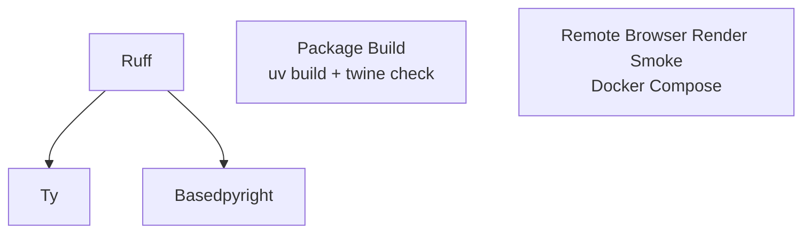

# CI Actions

本页只描述 GitHub Actions 的职责、触发条件和排障入口。测试 profile、Python 版本矩阵和架构矩阵见 [测试矩阵](testing-matrix.md)。

## 工作流总览

| Workflow           | 文件                                    | 主要职责                                                                 | 触发条件                                 |
| ------------------ | --------------------------------------- | ------------------------------------------------------------------------ | ---------------------------------------- |
| CI                 | `.github/workflows/ci.yml`              | lint、类型检查、打包校验、远程浏览器 smoke                               | push master、pull request、手动触发      |
| Coverage           | `.github/workflows/coverage.yml`        | Python 版本 + CPU 架构覆盖率矩阵                                         | push master、pull request、手动触发      |
| Docs               | `.github/workflows/docs.yml`            | master 推送时严格构建文档                                                 | push master（文档路径）、手动触发        |
| Docs PR Preview    | `.github/workflows/docs-pr-preview.yml` | PR 文档预览部署与关闭清理                                                | pull request open/sync/close（文档路径） |
| Publish (TestPyPI) | `.github/workflows-disabled/publish-test.yml` | 保留 TestPyPI 发布实现，当前挂起                                     | 无                                       |
| Auto Tag           | `.github/workflows/auto-tag.yml`        | PR 合并到 master 后读取 `pyproject.toml` 版本号自动打 tag 并触发 Publish | pull request closed on master            |
| Publish            | `.github/workflows/publish.yml`         | 构建分发包、PyPI、GitHub Release，并在成功后部署版本化文档                | tag push、手动触发                       |

## CI

`CI` workflow 是 PR 的主要合并门禁。



- `Ruff` 使用 `uv run ruff check .`，覆盖仓库内所有未排除文件；
- `Ty` 与 `Basedpyright` 在 Ruff 通过后运行；
- `Package` 通过 `uv build` 构建 wheel 与 sdist，再用 `twine check dist/*` 校验包元数据；该 job 在 fork PR 上也会运行（不需要 secrets），用于兜底验证打包可行性；
- `Remote Browser Render Smoke` 使用 `tests/infra/docker-compose.remote-test.yaml`，验证远程浏览器渲染路径。

测试用例由 `Coverage` workflow 负责，CI workflow 不再单独跑 pytest。

手动触发可设置 `debug_enabled=true` 输出 `uv pip list` 与 `uv tree`。

## Coverage

`Coverage` workflow 按 [测试矩阵](testing-matrix.md) 覆盖 Python 版本与 CPU 架构。每个矩阵项会生成独立的 coverage XML 与 pytest log，并上传到 Codecov：

```text
coverage-py<python-version>-<arch>.xml
pytest-py<python-version>-<arch>.log
```

## Docs

`Docs` workflow 只在 master 分支 push 且涉及以下路径时运行：

- `docs/**`
- `mkdocs.yml`
- `README.md`
- `.github/workflows/docs.yml`

它只执行严格文档构建：

```bash
uv run zensical build --strict
```

版本化部署由 Publish workflow 在正式发布成功后执行，避免未发布版本提前成为 `latest`。多版本管理细节见 [文档版本管理](versioning.md)。

非 master 分支或 PR 上的文档预览由 `Docs PR Preview` 负责，不再走分支名预览。

## Docs PR Preview

`Docs PR Preview` workflow 在 PR 触发文档相关变更时运行，用 [`rossjrw/pr-preview-action`](https://github.com/rossjrw/pr-preview-action) 部署预览页面。

- 触发：`pull_request` 的 `opened` / `synchronize` / `reopened` / `closed`，路径过滤同 `Docs`；
- 部署位置：`gh-pages` 分支下 `pr-preview/pr-<NUMBER>/`；
- PR 关闭时自动删除该目录；
- action 会在 PR 上贴 sticky comment，给出预览 URL；
- fork PR 跳过：`GITHUB_TOKEN` 在 fork 上拿不到 `contents: write`，无法部署。

预览 URL 形如：

```text
https://<owner>.github.io/<repo>/pr-preview/pr-<NUMBER>/
```

## Publish (TestPyPI)

TestPyPI 发布当前挂起。完整 workflow 保留在 `.github/workflows-disabled/publish-test.yml`，不位于 GitHub Actions 注册目录，因此没有 PR 或手动触发入口。

保留实现仍会以 `pyproject.toml` 的当前版本为 base，附加 UTC 时间戳 dev 后缀，构建 wheel 与 sdist，并通过 trusted publishing 上传 TestPyPI。恢复时需将文件移回 `.github/workflows/`，再明确配置所需触发器；不能只修改文档或 environment。

```bash
pip install -i https://test.pypi.org/simple/ \
  --extra-index-url https://pypi.org/simple/ \
  nonebot-plugin-htmlrender==<dev-version>
```

`environment: testpypi` 与 `https://test.pypi.org/legacy/` 仓库 URL 仍保留在挂起的 workflow 中。

## Auto Tag

`Auto Tag` workflow 在 PR 合并到 master 后自动完成「打 tag → 触发 Publish」，避免维护者手动操作。

- 触发：`pull_request` 的 `closed` 且 `merged == true`；
- 流程：
    1. 检出 master，`uv version --short` 读取当前版本号；
    1. 校验 `v<version>` tag 是否已存在，存在则跳过；
    1. 用 `github-actions[bot]` 身份创建带注解 tag 并推送；
    1. 通过 `gh workflow run publish.yml -f release_tag=v<version>` 触发 Publish。
- 直接用 `GITHUB_TOKEN` 推 tag **不会**链式触发其他 workflow，所以必须显式 `gh workflow run` 调起 `publish.yml`，权限需要 `contents: write` + `actions: write`。

如果 PR 没改版本号，则 tag 已存在，整个流程会跳过。

## Publish

`Publish` workflow 负责正式发布产物：

1. 解析并检出待发布 tag；
1. 校验 tag 指向 `master` 历史、tag 名与包版本完全一致；
1. 使用 `uv build` 构建 wheel 与 sdist；
1. 上传构建产物和构建日志 artifact；
1. 通过 PyPI trusted publishing 发布；
1. 根据 tag 或 `release_tag` 输入创建 GitHub Release。
1. GitHub Release 创建成功后严格构建 tag 对应文档，通过 `mike` 部署该版本并更新 `latest`。

触发方式：

- 由 `Auto Tag` 通过 `workflow_dispatch` 自动调起（推荐路径）；
- 也可以维护者手动 push 一个 tag 到 master 上的 commit；
- 也可以手动 `workflow_dispatch` 并提供 `release_tag` 输入。

无论通过哪种方式触发，Publish 都从 tag 检出源码，不会用 dispatch 所在分支的工作树替代发布内容。Mike 部署是发布的后置 job；PyPI 或 GitHub Release 失败时不会运行。

## 本地对应命令

| CI 项                  | 本地命令                                  |
| ---------------------- | ----------------------------------------- |
| 依赖同步               | `make sync-all`                           |
| Ruff 格式化            | `make ruff-format`                        |
| Ruff 检查              | `make ruff-check`                         |
| Basedpyright           | `make typecheck`                          |
| Ty                     | `make ty`                                 |
| Coverage profile tests | `make test-ci`                            |
| Local browser tests    | `make install-browser && make test-local` |
| Remote browser smoke   | `make remote-smoke`                       |
| Docs build             | `make docs-build`                         |
| Build artifacts        | `make build-artifacts`                    |

`make check` 会运行常用本地门禁；完整目标说明见 [工程协作与规范](../contributing/engineering-guide.md)。

!!! info "远程 smoke 的缓存策略"

    本地默认使用 `make remote-smoke`，复用已有镜像层与容器内依赖环境。
    只有基础镜像、`pyproject.toml`、`uv.lock` 或 `tests/infra/dockerfile.remote-test` 变更后，才需要执行 `make remote-smoke-build`。
    CI 中的 `Remote Browser Render Smoke (Docker)` job 会先通过 Docker Buildx 预构建 `render` 镜像，并把 Docker 层缓存写入 GitHub Actions cache；后续频繁触发时可直接复用基础镜像层和 `uv sync` 构建层，避免每次完整重建。

## 排障入口

- 首先看失败 job 的最后 200 行日志；
- 对测试失败，下载 `coverage-debug-*` artifact；
- 对远程浏览器 smoke，下载 `remote-smoke-compose-logs`；
- 对文档构建失败，下载 `docs-build-logs`；
- 对打包失败，下载 `package-dist` 与 `package-build-logs`；
- 对正式发布失败，下载 `publish-build-logs`；
- 对正式发布后的文档部署失败，下载 `release-docs-build-logs`；
- TestPyPI workflow 恢复后若发布失败，下载 `publish-test-build-logs` 与 `artifact-testpypi`；
- 对 Auto Tag 失败（tag 推送或 publish dispatch 失败），查看 job 日志中的 `gh` 命令输出。
