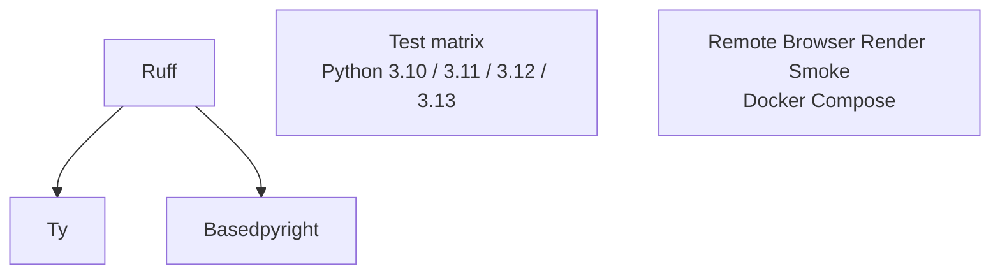

# CI Actions

本页只描述 GitHub Actions 的职责、触发条件和排障入口。测试 profile、Python 版本矩阵和架构矩阵见 [测试矩阵](testing-matrix.md)。

## 工作流总览

| Workflow | 文件 | 主要职责 | 触发条件 |
| --- | --- | --- | --- |
| CI | `.github/workflows/ci.yml` | lint、类型检查、单测、远程浏览器 smoke | push、pull request、手动触发 |
| Coverage | `.github/workflows/coverage.yml` | Python 版本 + CPU 架构覆盖率矩阵 | push、pull request、手动触发 |
| Docs | `.github/workflows/docs.yml` | 文档构建、预览部署、主分支版本化部署 | 文档相关路径变更、手动触发 |
| Publish | `.github/workflows/publish.yml` | 构建分发包、PyPI trusted publishing、GitHub Release | tag push、手动触发 |

## CI

`CI` workflow 是 PR 的主要合并门禁。



- `Ruff` 使用 `uv run ruff check .`，覆盖仓库内所有未排除文件；
- `Ty` 与 `Basedpyright` 在 Ruff 通过后运行；
- `Test` 按 [测试矩阵](testing-matrix.md) 执行 Python 版本覆盖，并发运行 `pytest tests -n auto --dist=loadfile -ra`；
- `Remote Browser Render Smoke` 使用 `tests/infra/docker-compose.remote-test.yaml`，验证远程浏览器渲染路径。

手动触发时可设置：

- `debug_enabled=true`：输出 `uv pip list` 与 `uv tree`；
- `pytest_extra_args`：追加 pytest 参数，用于临时放大或缩小测试范围。

## Coverage

`Coverage` workflow 按 [测试矩阵](testing-matrix.md) 覆盖 Python 版本与 CPU 架构。每个矩阵项会生成独立的 coverage XML 与 pytest log，并上传到 Codecov：

```text
coverage-py<python-version>-<arch>.xml
pytest-py<python-version>-<arch>.log
```

## Docs

`Docs` workflow 只在文档相关路径变化时运行：

- `docs/**`
- `mkdocs.yml`
- `README.md`
- `.github/workflows/docs.yml`

它会先执行严格文档构建：

```bash
uv run zensical build --strict
```

主分支 push 会用 `mike` 将当前 `pyproject.toml` 版本部署为版本化文档，并更新 `latest` alias；非主分支 push 会部署 preview 到 `gh-pages` 的 `preview/<branch>/`。

## Publish

`Publish` workflow 负责发布产物：

1. 使用 `uv build` 构建 wheel 与 sdist；
2. 上传构建产物和构建日志 artifact；
3. 通过 PyPI trusted publishing 发布；
4. 根据 tag 或手动输入创建 GitHub Release。

手动触发时，必须提供 `release_tag` 或确保当前上下文能解析到 tag。

## 本地对应命令

| CI 项 | 本地命令 |
| --- | --- |
| 依赖同步 | `make sync-all` |
| Ruff 格式化 | `make ruff-format` |
| Ruff 检查 | `make ruff-check` |
| Basedpyright | `make typecheck` |
| Ty | `make ty` |
| CI profile tests | `make test-ci` |
| Local browser tests | `make install-browser && make test-local` |
| Remote browser smoke | `make remote-smoke` |
| Docs build | `make docs-build` |
| Build artifacts | `make build-artifacts` |

`make check` 会运行常用本地门禁；完整目标说明见 [工程协作与规范](../contributing/engineering-guide.md)。

!!! info "远程 smoke 的缓存策略"
    本地默认使用 `make remote-smoke`，复用已有镜像层与容器内依赖环境。
    只有基础镜像、`pyproject.toml`、`uv.lock` 或 `tests/infra/dockerfile.remote-test` 变更后，才需要执行 `make remote-smoke-build`。

## 排障入口

- 首先看失败 job 的最后 200 行日志；
- 对测试失败，优先下载 `test-logs-*` 或 `coverage-debug-*` artifact；
- 对远程浏览器 smoke，下载 `remote-smoke-compose-logs`；
- 对文档构建失败，下载 `docs-build-logs`；
- 对发布失败，下载 `publish-build-logs` 并检查 `dist/` 产物。
