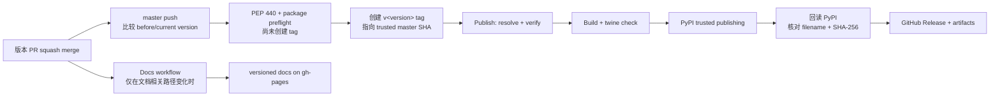

# 发布流程

正式发布以一个经过 review 的版本 PR 开始，以不可移动的 `v<version>` tag 为源代码锚点。PyPI、GitHub Release 和版本化文档是三条相互关联但独立执行、独立恢复的链路。

## 发布前提

版本 PR 必须：

1. 将 `pyproject.toml` 中的项目版本更新为目标版本，并通过 `uv` 更新锁文件；
2. 完成与该版本相关的实现、测试、迁移说明和用户文档；
3. 通过 [Pull Request 生命周期](../contributing/pull-requests.md)中列出的 review 与 checks；
4. 本地或 CI 验证 wheel、sdist 及包元数据：

```bash
make build-artifacts
```

该 target 内部执行 `uv build --no-sources` 和 pinned `twine==6.2.0 check`。`--no-sources` 很重要：发布构建不得因本地 workspace source 覆盖而得到一个无法从锁定依赖重现的产物。

## 自动发布主链路



### Auto Tag on Version Change

`Auto Tag on Version Change` 只监听 `master` 上涉及 `pyproject.toml` 的 push。检测和写操作均发生在合并后的受信任 `master` 上，因此版本 PR 可以来自 fork，不需要让 fork PR workflow 持有写权限。

1. 检出事件中的当前 `github.sha`，并确认它位于 `origin/master`；
2. 从 `github.event.before` 的 `pyproject.toml` 读取旧版本，再与当前项目版本比较；
3. 如果版本相同则正常结束，即使本次只修改了依赖或其他项目配置也不会发布；
4. 只有版本实际变化时才用 pinned `packaging` 验证 PEP 440：新旧版本必须使用 canonical spelling，新版本必须严格递增，且不能带 PyPI 不接受的 local segment；
5. 在 tag 产生前检查锁文件，构建唯一 wheel/sdist 并执行 pinned Twine 校验；package preflight 失败不会占用版本号；
6. preflight 成功后解析 `v<version>` 并查询远程 tag；tag 不存在时创建带注解 tag，使其准确指向本次 trusted master SHA；已指向同一 SHA 时复用，指向其他 commit 时失败；
7. 以该 tag ref 显式 dispatch `Publish`。

普通 PR、只修改依赖配置的 PR 或未改变 `project.version` 的直接 push 都不会创建 tag。发布触发条件是 push 前后版本值发生变化，不依赖 PR 来源仓库或特定合并事件。

由 `GITHUB_TOKEN` push 产生的事件不会再次触发普通 downstream workflow；显式 `workflow_dispatch` 是发布契约的一部分，也使同一 tag 的恢复可重复执行。

### Publish 的不可逆操作前校验

任何 PyPI 上传发生前，`Publish` 都必须解析并验证唯一发布 tag：

- tag 名符合 `v<version>`；
- tag 确实存在，checkout 的 `HEAD` 与 tag 指向同一 commit；
- 该 commit 位于 `origin/master` 历史中；
- tag 去掉前缀 `v` 后与 `pyproject.toml` 的项目版本完全一致；
- `uv build --no-sources` 与 `twine check` 成功。

验证和构建 job 只需要只读权限。构建产物通过 artifact 传给后续 job；只有 PyPI job 获得 OIDC `id-token: write`，只有 GitHub Release job 获得写 release 所需的 `contents: write`。

### PyPI 与 GitHub Release

PyPI 使用 `release` environment 和 trusted publishing，不保存长期 API token。上传完成后，独立 verification job 会重试读取 PyPI JSON，并要求远端文件集合与本次 artifact 的 filename、SHA-256 **完全一致**。只有这个不可变远端状态通过验证，GitHub Release 才会绑定同一个 tag 并附加同一批 wheel 与 sdist。这样恢复时即使使用 `skip-existing`，也不会让 PyPI 与 GitHub Release 指向不同字节。

手动运行 `Publish` 只用于恢复或维护者明确批准的发布，必须提供已经存在的 `release_tag`。workflow definition 只能从默认分支或与输入一致的 tag ref 运行，并仍执行全部 source/version/build/hash 校验，不能用 feature branch workflow 或手动输入绕过发布不变量。`release` environment 也应在仓库设置中只允许受保护的默认分支与 release tags。

## TestPyPI

`Publish (TestPyPI)` **只支持维护者手动触发**，不会在每个 PR 上自动上传。它从当前项目版本生成唯一 dev version，构建并校验产物，再通过 `testpypi` environment 的 trusted publishing 上传。

TestPyPI 用于安装行为或包元数据的人工验收，不是 PR 必需 check，也不能替代正式发布前的 tag/source/version 校验。

## 文档是独立发布链路

`Docs` 监听 `master` 上的文档、文档配置和文档工作流相关路径。它读取合并后 `pyproject.toml` 的版本，用 `mike` 更新 `gh-pages` 上的版本目录与 `latest`。

因此：

- 版本 PR 包含文档相关变更时，Docs 与软件发布会并行开始；
- 没有文档相关路径变化时，创建 tag 不会单独触发 Docs；
- Docs 成功不代表 PyPI / GitHub Release 成功，反之亦然；
- PR 文档预览目录不属于正式版本，关闭 PR 后会由独立 cleanup workflow 删除。

版本目录和 `gh-pages` 写入策略见 [文档版本管理](versioning.md)。

## 部分失败恢复 { #partial-failure-recovery }

先确认已完成到哪一条不可逆边界，再只恢复失败链路：

| 状态 | 恢复方式 |
| --- | --- |
| tag/source/version 不变量校验失败 | 停止发布并核对 tag 来源；代码或版本确有错误时发起新的版本 PR。除非维护者确认 tag 从未对外发布且明确承担历史变更风险，否则不要移动或重建原 tag |
| build / `twine check` 失败，尚未上传 PyPI | 基础设施瞬时故障可对同一 tag 重跑；产物或 metadata 确有错误时提升版本并走新的版本 PR |
| 校验和构建成功，PyPI 因临时故障失败 | 对同一已验证 tag 重新运行 `Publish` |
| PyPI 已成功，GitHub Release 失败 | 优先重跑保留原 artifact 的 workflow；重跑发布恢复路径时，PyPI hash verification 必须证明重建产物与已发布文件相同，才会补齐 GitHub Release |
| PyPI 已有同名文件但 hash verification 不一致 | 立即停止自动恢复；保留双方 hash 和 workflow artifact，核对最初发布 run，不得用 `--clobber` 把不同字节附到 GitHub Release |
| GitHub Release 已存在但附件缺失 | 核对 tag 和 PyPI 文件哈希后，重新运行或从该 workflow 的已验证 artifact 补齐附件 |
| Docs 失败，但软件发布成功 | 单独重新运行 `Docs`；不要重新发 PyPI，也不要创建新 tag |
| Docs 成功，但软件发布失败 | 保留已部署文档，按发布 workflow 的失败阶段恢复；必要时在用户文档中暂缓宣称版本可安装 |

!!! danger "不要覆盖已发布版本"
    PyPI 文件不可替换。只要任一产物已经发布，就不得复用版本号重新构建，也不得移动对应 tag。需要修改代码或产物时必须提升版本并走新的版本 PR。

## 发布后核对

- PyPI 页面显示目标版本，wheel 与 sdist 均存在；
- 从 PyPI 安装的包能被 NoneBot 加载；
- GitHub Release 指向正确 tag，附件与 PyPI 产物一致；
- 若本次触发 Docs，版本 URL 与 `latest` 可访问；
- `master`、tag、包元数据与文档展示的版本一致；
- 对任何失败保留 workflow run、artifact 和恢复操作记录。
