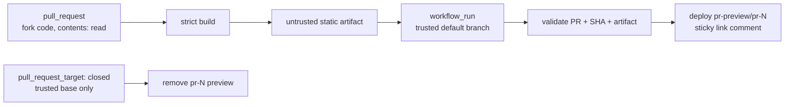

# CI Actions

本页描述 GitHub Actions 的职责和信任边界。测试 profile、Python/架构矩阵与条件 smoke 见 [测试矩阵](testing.md)，合并规则见 [Pull Request 生命周期](pull-requests.md)，远端 Ruleset 与 environment 契约见[仓库治理与保护](governance.md)。

## 工作流总览

| Workflow | 文件 | 主要职责 | 触发条件 |
| --- | --- | --- | --- |
| CI | `.github/workflows/ci.yml` | Ruff format/check、类型检查、分发安装矩阵、远程浏览器 smoke、`noneload` | push `master`、PR、手动 |
| Coverage | `.github/workflows/coverage.yml` | Python 3.10–3.14 × x64/arm64 pytest/coverage | push `master`、PR、手动 |
| Prek | `.github/workflows/prek.yml` | 仓库级 pre-commit hooks | push `master`、PR、手动 |
| Docs PR Preview Build | `.github/workflows/docs-pr-preview.yml` | 检测文档相关变更，以只读权限严格构建静态站 | PR open/sync/reopen |
| Docs PR Preview Deploy | `.github/workflows/docs-pr-preview-deploy.yml` | 校验并发布 build artifact，更新 PR 预览评论 | preview build 完成 |
| Docs PR Preview Cleanup | `.github/workflows/docs-pr-preview-cleanup.yml` | 删除已关闭 PR 的 Pages 预览 | PR closed |
| Docs | `.github/workflows/docs.yml` | 对每个可能成为 release source 的 `master` SHA 执行严格文档构建，不写 Pages | push `master`、手动 |
| Publish (TestPyPI) | `.github/workflows/publish-test.yml` | 构建唯一 dev version 并 trusted publish 到 TestPyPI | **仅手动** |
| Auto Tag on Version Change | `.github/workflows/auto-tag.yml` | 汇合同一 master SHA 的 CI/Coverage/Docs/Prek，验证版本递增后 tag 并 dispatch `Publish`；也提供受同等门禁约束的 pre-tag recovery | 四条 required workflow 完成、受约束的手动恢复 |
| Publish | `.github/workflows/publish.yml` | 校验 tag/source/version，发布并回读 PyPI、创建 GitHub Release，最后部署对应 tag 的版本文档 | `v*` tag、受约束的手动恢复 |

## PR 必需质量层

### CI

`CI` 是静态质量、分发包和跨容器行为的主入口：

- `Ruff`：依次运行 `ruff format --check` 与 `ruff check`，只验证 checkout，不改写文件；
- `Ty` 与 `Basedpyright`：两套类型检查器分别执行；
- `Package Build`：`uv build --no-sources` 构建 wheel/sdist，用 `twine check` 校验metadata，并在 Python 3.12 隔离安装 bare core、`[htmlkit]`、`[takumi]` 与`[pillow,skia]`；
- `Wheel Smoke`：复用同一 artifact，在 Python 3.10、3.11、3.13、3.14 隔离安装wheel，断言 core 零 backend，并为受支持的 native extra 执行真实 PNG；
- `Remote Browser Render Smoke (Docker)`：通过 Docker Compose 顺序验证远程 Playwright WebSocket 的 MEMORY 与 filehost 路径，覆盖 text、Markdown 相对图片、CSS 字体/背景和模板本地资源，并检查 filehost 请求头、CORS、资源后缀与未认证 403；
- `NoneBot Plugin Load`：调用 `BalconyJH/noneload` reusable workflow，在 Python 3.10–3.14 隔离安装并加载插件。

pytest 不在 `CI` 中重复执行，由 `Coverage` 统一覆盖。

`Required Checks` 是 always-run 汇总 job；上述任一层失败、取消或跳过都会使它失败。Ruleset 绑定这个稳定名称即可覆盖内部 job 和 `noneload` 矩阵，而不必在每次扩展 Python 或后端维度时更新 required check 列表。

### Coverage

`Coverage` 对 Python 3.10–3.14 分别在 x64 和 arm64 runner 上执行 CI profile。各矩阵项独立失败，不因一个版本失败而取消其他版本，并产生：

```text
coverage-py<python-version>-<arch>.xml
pytest-py<python-version>-<arch>.log
```

XML 上传 Codecov，日志与 XML 同时作为 `coverage-debug-*` artifact 保留。每个矩阵项要求总覆盖率不低于 90%；不应用排除新代码或删除有效测试来规避阈值。

`Coverage Matrix` 汇总完整矩阵，只在所有版本与架构均成功时通过，并为 Ruleset 提供稳定 check 名称。

### Prek

`Prek` 复用 `.pre-commit-config.yaml`，并在 CI 中固定工具版本。workflow 对每次push、PR 和手动运行执行两层检查：

```bash
prek run --all-files --show-diff-on-failure --color=always
prek run actionlint --all-files --hook-stage=manual --show-diff-on-failure --color=always
```

第一条执行默认 stage 的仓库级 hooks；第二条显式执行较慢的 `actionlint` 及其ShellCheck 集成。CI 始终运行两条，本地至少运行第一条，修改 workflow 时必须同时运行第二条。hook 的自动修复、`commit-msg` 和增量检查契约见[工程协作流程](engineering-workflow.md#prek-gates)。

### noneload 的边界

`noneload` 验证隔离安装、插件 import/load、NoneBot metadata/config 以及依赖插件加载。它不能替代 pytest、真实浏览器启动或 Docker smoke。

本仓库对 reusable workflow 的直接引用固定到 `BalconyJH/noneload` v1.0.1 的完整 commit SHA。该 reusable workflow 内部引用的 actions / `noneload` action 由上游维护，可能仍使用 moving major tag；这是跨仓库 reusable workflow 的**传递性例外**，无法由调用方在本仓库覆盖。升级该 SHA 时必须 review 上游 workflow 及其传递依赖，而不是只看 release tag。

## Fork-safe 文档预览 { #fork-safe-docs-preview }

文档预览被拆成三个 workflow，以同时满足 fork 支持和最小权限：



### 1. Build

`Docs PR Preview Build` 在普通 `pull_request` 上运行，因此 fork PR 只有只读 token。它通过 GitHub API 检查整个 PR 的 changed files；以下路径会触发 strict build：

- `docs/**`、`mkdocs.yml`、`README.md`；
- `pyproject.toml`、`uv.lock`、`.python-version`、`Makefile`；
- Docs 与 preview 相关 workflow 文件。

构建使用 PR checkout，但不接触写权限或环境 secrets，完成后只上传短期 `docs-preview-site` artifact。

always-run 的 `Docs Preview` 汇总 job 是该 workflow 的稳定门禁：没有文档输入变化时正常通过，有变化时则要求 strict build 与 artifact 上传成功。

### 2. Deploy

`Docs PR Preview Deploy` 由 `workflow_run` 触发。只读的 `resolve` job 先检查上游 run 是否产生预览 artifact；普通代码 PR 没有 artifact 时会正常结束，不会把“不需要预览”误报为部署失败。需要预览时，后续 `deploy` job 才在受信任上下文取得 Pages 写权限。它不会 checkout PR 分支或执行 artifact 中的程序，而是：

1. 要求上游 build 成功并且恰好产生一个未过期且下载前大小不超过上限的 `docs-preview-site` artifact；
2. 要求 workflow run 恰好关联一个仍然 open 的 PR；payload 未携带关联时，用 head commit API 做受约束回查；
3. 核对 workflow run 的 head SHA 仍是该 PR 当前 head，过期 run 正常跳过；
4. checkout 受信任的默认分支并下载指定 run 的 artifact；
5. 拒绝 symlink、特殊文件、异常文件数量或异常体积；
6. 仅把验证后的静态目录部署到 `gh-pages/pr-preview/pr-<NUMBER>/`；
7. 创建或更新带固定 marker 的 PR 评论，给出预览链接。

预览 URL 形如：

```text
https://<owner>.github.io/<repo>/pr-preview/pr-<NUMBER>/
```

文件约束校验不等于内容净化。部署 workflow 不会把 artifact 当作 shell、workflow script 或模板执行，但 reviewer 打开页面时，其中的 HTML/JavaScript 会由浏览器执行。

PR preview 只是同一 GitHub Pages origin 下的路径命名空间，并不是隔离域。公开 fork 可以控制该预览内容，因此必须把它视为不可信站点：不要在该 Pages origin 保存 secret、token 或可信的 `localStorage` 状态，不要让正式页面依赖同源机密，并建议用不带敏感登录状态的浏览器 profile 评审预览。

### 3. Cleanup

`Docs PR Preview Cleanup` 监听 `pull_request_target: closed`，且**不使用 paths filter**，保证任何曾经部署过预览的 PR 都能在关闭后清理。它只 checkout 默认分支，并把事件中的数字 PR number 传给删除 action，绝不 checkout 或执行 fork code。

不要把三段重新合成一个带 `pull_request_target` checkout 的 workflow；那会把仓库写 token 暴露给不受信任的 PR 代码。

## 正式文档部署

`Docs` 在 `master` 文档相关路径变更时只执行 strict build。版本 PR 合并后，它的成功结果作为同一 source SHA 的发布门禁，但不会提前创建正式版本目录或移动 `latest`。

只有 `Publish` 完成 PyPI hash 回读与 GitHub Release 后，`Publish versioned documentation` 才重新检出经过验证的 tag、再次 strict build，并调用 `mike` 写入正式版本目录。这样 `/0.8.0/` 表示该版本已经存在可安装产物，而不是“某个版本 PR 已合并”。

正式版本和 PR previews 仍共享生成物分支 `gh-pages`。不同 PR 的 preview 更新互不取消；正式部署与 preview action 每次从最新远程状态开始，只使用非 force push，并在冲突时有限重试，避免一个 writer 覆盖另一个 writer 已发布的目录。

文档版本语义和独立恢复方式见 [文档版本管理](documentation-versioning.md) 与 [发布流程](release.md)。

## TestPyPI 与正式发布

`Publish (TestPyPI)` 仅供维护者手动运行。它不是 PR workflow，不会自动评论安装命令，也不会给 fork 或同仓库 PR 自动发布 dev package。

`Auto Tag on Version Change` 只在同一 source SHA 的 `CI`、`Coverage`、`Docs`、`Prek` 全部成功后继续。三条通用 required workflow 对 `master` push 使用 source SHA 作为 concurrency key，不会因为后续 PR 很快合并而取消版本提交的门禁；PR 更新仍会取消自身的过期 run。

版本差异检测、tag/source/version 不变量、trusted publishing 权限拆分及部分失败恢复见 [发布流程](release.md)。普通 `pyproject.toml` 配置变更在版本未变化时不会发布。发布 workflow 的写权限按 job 收窄，不允许构建步骤同时持有 PyPI OIDC 和仓库写权限。

## Action 供应链

- 所有本仓库直接使用的第三方与 GitHub actions 固定到完整 commit SHA，行尾注释记录对应 release 版本；
- CI 与发布 workflow 固定 `uv==0.11.28`；Docker remote smoke 的 bootstrap 也使用同一版本，升级时应作为工具链变更统一验证；
- `.github/dependabot.yml` 定期检查 `github-actions` 更新；Dependabot PR 仍需 review release notes、action diff 与权限变化；
- reusable workflow 的传递依赖例外按上文 `noneload` 规则审计；
- 不接受只把固定 SHA 改为 `@main`、`@master` 或 moving major tag 的更新。

## 本地对应命令

| CI 层 | 本地命令 |
| --- | --- |
| 同步锁定开发环境 | `make sync-all` |
| Prek 默认 hooks | `prek run --all-files` |
| Prek workflow hooks | `prek run actionlint --all-files --hook-stage=manual` |
| Ruff 格式化 | `make ruff-format` |
| Ruff 格式验证 | `make ruff-format-check` |
| Ruff lint | `make ruff-check` |
| Basedpyright | `make typecheck`（源码零诊断 + package type completeness 100%） |
| Ty | `make ty` |
| Coverage profile tests | `make test-ci` |
| Local browser tests | `make install-browser && make test-local` |
| Remote browser smoke | `make remote-smoke` |
| Strict docs build | `make docs-build` |
| Build artifacts + metadata check | `make build-artifacts` |

`make test-ci` 包含 documentation contract：检查旧契约、公共导出、完整配置路径和 Python 示例；`make typecheck` / `make ty` 同时覆盖 examples。`make docs-build` 负责链接、导航和页面渲染，不能替代前两类检查。

## 排障入口

- 测试失败：下载对应 `coverage-debug-*` artifact，先看 pytest log 最后 200 行；
- 远程浏览器失败：下载 `remote-smoke-compose-logs`，区分容器启动、WebSocket 和资源加载错误；
- 文档预览 build 失败：本地设置同样的 `DOCS_*` preview 环境变量后 strict build；
- 文档预览 deploy 被拒绝：检查关联 PR 数、PR 当前 head SHA 和 artifact 文件约束；
- master 文档门禁失败：下载 `docs-build-logs`，本地执行 `make docs-build`；
- 发布后的版本文档失败：下载 `release-docs-build-log` / `release-docs-deploy-log`；确认 PyPI 与 GitHub Release 已正确后，对同一 tag 重跑 `Publish`，不得从 release 分支手工复制 `site/`；
- 打包失败：下载 package dist/build logs，并用 `make build-artifacts` 本地重现完整构建与 pinned `twine` 校验；
- 发布失败：先判断 PyPI 是否已经产生不可逆上传，再核对 PyPI verification 的 filename/hash 结果，并按 [部分失败恢复](release.md#partial-failure-recovery)处理；
- Auto Tag 未创建 tag：先核对同一 `workflow_run.head_sha` 的 CI/Coverage/Docs/Prek 是否全部 completed/success，再检查第一父提交与当前 `project.version`、trusted master SHA 和 tag 指向；禁止直接移动已发布 tag。
