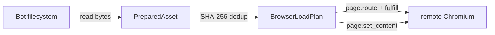

# 远程 Playwright 与资源桥

远程模式下，HTML 在 Bot 进程中生成，Chromium 却运行在另一个进程、容器甚至主机。v0.7.2 不再假设远端浏览器可以读取 Bot 的 filesystem：页面文档通过 `page.set_content()` 注入，本地图片、字体与 CSS 等资源默认通过 render-scoped 内存资产桥传输。

最重要的结论：

- `md_to_pic`、`render_markdown`、`render_text` 与内置模板不会再导航到包内 `file://` URL；
- 远程有效默认值是 `resource_resolve_mode=auto` 与 `remote_local_resource_policy=memory`；
- filehost 降为显式兼容模式，不再是远程部署的默认前提；
- `PreparedHtml.base_url` 只解析相对资源，只有显式 `PageConfig.document_url` 才触发 `page.goto()`。

## 三种部署形态

| 形态                  | 浏览器位置        | 默认本地资源处理 | 适用场景                                |
| --------------------- | ----------------- | ---------------- | --------------------------------------- |
| 本地 Playwright       | 与业务进程同机    | 本地文件策略     | 单机部署、调试                          |
| 远程 Playwright（WS） | Playwright Server | 内存资产桥       | 完整 Playwright 协议、多 Bot 共用浏览器 |
| 远程浏览器（CDP）     | Chromium          | 内存资产桥       | 已有 CDP 基础设施、容器化部署           |

### 远程 Playwright（WS）

=== "Dotenv"

    ```dotenv
    RENDER_BACKEND=playwright
    RENDER_PLAYWRIGHT={"connect_ws":{"endpoint":"ws://playwright:53333/playwright"}}
    ```

=== "nonebot.init"

    ```python
    import nonebot

    nonebot.init(
        render_backend="playwright",
        render_playwright={
            "connect_ws": {"endpoint": "ws://playwright:53333/playwright"},
        },
    )
    ```

### 远程浏览器（CDP）

=== "Dotenv"

    ```dotenv
    RENDER_BACKEND=playwright
    RENDER_PLAYWRIGHT={"connect_cdp":{"endpoint":"http://chromium:9222/"}}
    ```

=== "nonebot.init"

    ```python
    import nonebot

    nonebot.init(
        render_backend="playwright",
        render_playwright={
            "connect_cdp": {"endpoint": "http://chromium:9222/"},
        },
    )
    ```

通过 `startup_render(endpoint=...)` 动态建立的远程 session 与静态 `connect_ws` / `connect_cdp` 配置采用同一资源策略。判定依据是实际 session 的 `PlaywrightMode`，不是仅检查插件启动时的静态配置。

## 内存资产桥如何工作



准备阶段保留原始浏览器文档，并将实际引用的本地文件读成 `PreparedAsset`。Playwright 为每份内容生成 `https://htmlrender.invalid/.htmlrender/assets/<digest>` 合成地址，通过 `page.route()` 直接 `fulfill` bytes、媒体类型和 CORS 响应头。资产只存活到本次页面关闭：

- 不写入 localstore、临时文件或共享卷；
- 相同内容按 SHA-256 去重；
- Chromium 不需要访问 Bot 容器的路径；
- Takumi 消费同一份 `PreparedAsset.data`，不需要第二套传输协议。

合成域名不会发起真实网络请求；路由只在当前 Page 生命周期内注册。

## 资源策略

### 全局解析模式

| 配置                           | 含义                                     |
| ------------------------------ | ---------------------------------------- |
| `resource_resolve_mode=off`    | 默认不主动解析资源；显式调用参数仍可开启 |
| `resource_resolve_mode=auto`   | 按实际 session 的本地/远程策略解析       |
| `resource_resolve_mode=strict` | 同 `auto`，但无法解析的资源直接报错      |

### 远程本地资源策略

| `remote_local_resource_policy` | 行为                                                |
| ------------------------------ | --------------------------------------------------- |
| `memory`                       | 读为 `PreparedAsset` 并通过页面路由传输；远程默认值 |
| `passthrough`                  | 原值透传；仅适用于已明确配置相同路径共享卷的部署    |
| `filehost`                     | 转换为 filehost URL；显式兼容模式                   |
| `error`                        | 发现本地引用立即失败，用于强制禁止本地资源          |

`AUTO + MEMORY` 是远程有效默认组合。通常只需配置连接端点，不需要再提供 HTTP `base_url` 或安装 filehost extra。

### 本地模式策略

本地 Playwright 仍按 `local_local_resource_policy` 使用 `file`、`filehost` 或 `passthrough`；v0.7.2 的 `memory` 默认变更只针对远程 session。

## `base_url` 与 `document_url`

这些字段从 v0.7.2 起具有不同且不可混用的职责：

| 字段                      | 职责                                               | 是否触发导航           |
| ------------------------- | -------------------------------------------------- | ---------------------- |
| `PreparedHtml.base_url`   | 解析 HTML、CSS 中的相对资源                        | 否                     |
| `PageConfig.document_url` | 在注入 HTML 前打开一个真实浏览器可访问页面         | 是，调用 `page.goto()` |
| `PageConfig.base_url`     | v0.7.1 导航字段的弃用兼容别名，不再表示资源解析基址 | 同 `document_url`      |

无显式 `document_url` 时，页面停留在 `about:blank`，随后调用 `page.set_content(html)`。这正是 text、Markdown 与普通模板的默认路径。

旧代码若在 `PageConfig.base_url` 中表达导航目标，v0.7.2 会发出弃用警告。迁移时把导航目标改为 `document_url`；资源目录或 HTTP origin 属于 preparation 产生的 `PreparedHtml.base_url`。`PageConfig.base_url` 与 `document_url` 同时传入会报错，避免含糊解释。

若 `PreparedHtml` 没有显式资源基址而 `document_url` 是 HTTP(S)，浏览器会把该导航 URL 作为相对网络资源的 fallback；它不会写回 `PreparedHtml.base_url`。`file://` 导航则要求远端可见同一路径，并应只与显式 `passthrough` 共享卷策略组合。

```python
img = await render_template(
    "templates",
    template_name="card.html",
    templates={"avatar": "assets/avatar.png"},
)
```

上例由 filesystem 模板 source 自动以 `templates/` 作为资源基址，定位 `assets/avatar.png`；远程 Chromium 不会导航到该目录，文件会被准备为内存资产。

只有确实需要先打开网页时才设置 `document_url`：

```python
pages={"document_url": "https://render-origin.example/card"}
```

## 无基址的相对资源

内存 Markdown 字符串没有天然文件目录。若其中出现 `./image.png`：

- `resource_strict=True` 会报错，因为无法可靠定位文件；
- 默认非严格模式会记录 warning 并保留原引用。

从 Markdown 文件读取时，Markdown 文件与自定义 CSS 文件各自保留来源基址。因此正文里的相对图片按 Markdown 目录解析，CSS 中的字体或背景图按 CSS 文件目录解析。

## 何时显式使用 filehost

只有其他进程需要在当前 Page 生命周期之外访问稳定 HTTP URL，或既有部署已经围绕 `/filehost/*` 建立网关策略时，才选择：

```dotenv
RENDER_PLAYWRIGHT={"resource_resolve_mode":"auto","remote_local_resource_policy":"filehost"}
```

filehost 的 TTL 是 URL mapping TTL，不代表逐文件物理删除。物理文件由 `nonebot-plugin-filehost` 的进程级临时目录生命周期管理；htmlrender 不读取其私有文件字段，也不承诺渲染结束后立即删除单个文件。完整契约见 [资源准备与传输方案](../maintainers/architecture/filehost-resource-resolution.md)。

## 相关页面

- [Playwright 配置](config/playwright.md)
- [v0.7.2 迁移说明](migration-v072.md)
- [安全须知](security.md)
- [故障排查](troubleshooting.md)
